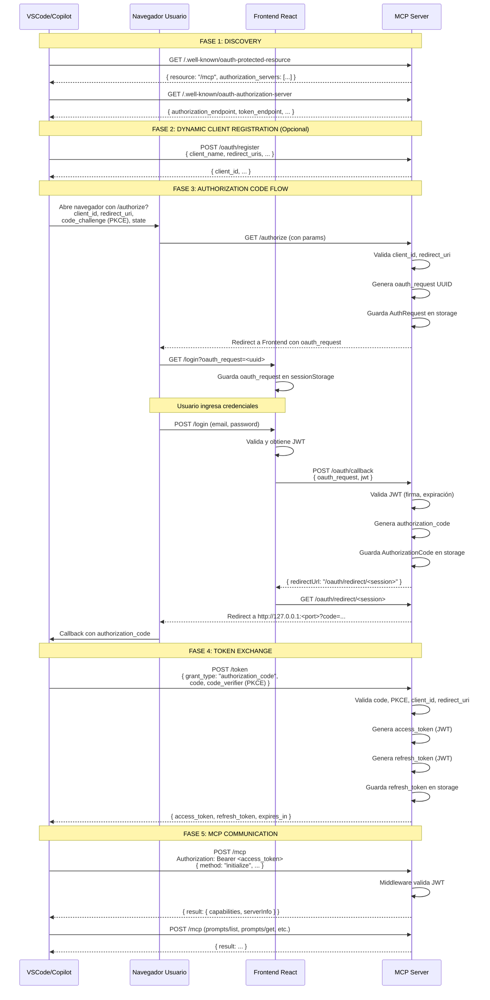

# 🔐 Análisis del Proyecto y Plan de Revocación de Tokens OAuth

**Fecha:** 17 de marzo de 2026  
**Versión:** 1.0  
**Autor:** Análisis del sistema MCP-PROMPS

---

## 📋 Tabla de Contenidos

1. [Análisis Arquitectónico del Proyecto](#1-análisis-arquitectónico-del-proyecto)
2. [Cómo se Conectan MCP y VSCode](#2-cómo-se-conectan-mcp-y-vscode)
3. [Problema Actual: Falta de Revocación](#3-problema-actual-falta-de-revocación)
4. [Plan de Implementación de Revocación](#4-plan-de-implementación-de-revocación)
5. [Implementación Detallada](#5-implementación-detallada)
6. [Integración Frontend](#6-integración-frontend)
7. [Testing y Validación](#7-testing-y-validación)
8. [Consideraciones de Seguridad](#8-consideraciones-de-seguridad)

---

## 1. Análisis Arquitectónico del Proyecto

### 1.1 Componentes Principales

```
┌─────────────────────────────────────────────────────────────────┐
│                        SISTEMA MCP-PROMPS                        │
├─────────────────────────────────────────────────────────────────┤
│                                                                  │
│  ┌──────────────────┐         ┌──────────────────────────────┐ │
│  │   VSCode Client  │         │   Frontend React             │ │
│  │  (GitHub Copilot)│         │  https://front-mcp-gules     │ │
│  │                  │         │        .vercel.app           │ │
│  └────────┬─────────┘         └──────────┬───────────────────┘ │
│           │                              │                      │
│           │ OAuth 2.0                    │ Login/Register       │
│           │ + MCP Protocol               │                      │
│           ▼                              ▼                      │
│  ┌─────────────────────────────────────────────────────────┐   │
│  │        MCP Server + OAuth Authorization Server          │   │
│  │        https://mcp-promps.onrender.com                  │   │
│  │                                                          │   │
│  │  ┌─────────────────┐  ┌──────────────────────────────┐ │   │
│  │  │ OAuth Endpoints │  │   MCP JSON-RPC Endpoint     │ │   │
│  │  │                 │  │   POST /mcp                  │ │   │
│  │  │ GET /.well-known│  │                              │ │   │
│  │  │ POST /authorize │  │   Methods:                   │ │   │
│  │  │ POST /token     │  │   - initialize               │ │   │
│  │  │ POST /oauth/    │  │   - prompts/list             │ │   │
│  │  │      callback   │  │   - prompts/get              │ │   │
│  │  │ POST /oauth/    │  │   - tools/list               │ │   │
│  │  │      register   │  │   - tools/call               │ │   │
│  │  └─────────────────┘  └──────────────────────────────┘ │   │
│  │                                                          │   │
│  │  ┌─────────────────────────────────────────────────────┐│   │
│  │  │          OAuth Storage (In-Memory)                  ││   │
│  │  │  - Auth Requests                                    ││   │
│  │  │  - Authorization Codes                              ││   │
│  │  │  - Refresh Tokens                                   ││   │
│  │  │  - Dynamic Clients                                  ││   │
│  │  └─────────────────────────────────────────────────────┘│   │
│  └─────────────────────────────────────────────────────────┘   │
│                                                                  │
└─────────────────────────────────────────────────────────────────┘
```

### 1.2 Tecnologías Utilizadas

| Componente | Tecnología |
|------------|------------|
| **Lenguaje** | TypeScript 5.9+ |
| **Runtime** | Node.js |
| **Framework HTTP** | Express 5.2 |
| **Protocolo MCP** | @modelcontextprotocol/sdk 1.26 |
| **Autenticación** | JWT (jsonwebtoken) |
| **OAuth 2.0** | Custom implementation (RFC 6749, RFC 7636 PKCE) |
| **Storage** | In-Memory Maps (⚠️ se pierde al reiniciar) |
| **Deployment** | Render.com |

### 1.3 Estructura de Archivos Clave

```
src/
├── index.ts                    # MCP Server STDIO (local)
├── server-http.ts             # HTTP Server + MCP endpoint
├── prompts.ts                 # Definiciones de prompts
├── middleware/
│   ├── auth.middleware.ts     # JWT validation + WWW-Authenticate
│   └── error.middleware.ts    # Error handlers
├── oauth/
│   ├── config.ts              # OAuth clients + configuración
│   ├── routes.ts              # OAuth endpoints (/.well-known, /authorize, /token)
│   └── storage.ts             # In-memory storage para OAuth data
├── templates/                 # Plantillas de prompts (16 prompts)
├── tools/                     # Herramientas MCP
└── types/
    └── auth.types.ts          # Tipos TypeScript para auth
```

---

## 2. Cómo se Conectan MCP y VSCode

### 2.1 Flujo Completo de Autenticación OAuth + MCP



### 2.2 Endpoints OAuth Implementados

#### Discovery Endpoints

| Endpoint | Método | Descripción | RFC |
|----------|--------|-------------|-----|
| `/.well-known/oauth-protected-resource` | GET | Protected Resource Metadata | RFC 9728 |
| `/.well-known/oauth-authorization-server` | GET | Authorization Server Metadata | RFC 8414 |

#### OAuth Flow Endpoints

| Endpoint | Método | Descripción | RFC |
|----------|--------|-------------|-----|
| `/oauth/register` | POST | Dynamic Client Registration | RFC 7591 |
| `/authorize` | GET | Inicio del flujo OAuth | RFC 6749 |
| `/oauth/callback` | POST | Callback desde frontend después del login | Custom |
| `/oauth/redirect/:sessionId` | GET | Redirect intermedio a VSCode localhost | Custom |
| `/token` | POST | Exchange code por access_token | RFC 6749 |

#### MCP Endpoint

| Endpoint | Método | Descripción |
|----------|--------|-------------|
| `/mcp` | POST | JSON-RPC 2.0 endpoint para MCP protocol |

### 2.3 Validación de Tokens (Middleware)

El middleware [auth.middleware.ts](src/middleware/auth.middleware.ts) realiza:

1. **Extrae el token** del header `Authorization: Bearer <token>`
2. **Verifica la firma JWT** usando `JWT_SECRET`
3. **Valida la expiración** del token
4. **Adjunta el payload** a `req.user`
5. **Responde 401** con header `WWW-Authenticate` si falla

```typescript
// Ejemplo de respuesta 401
WWW-Authenticate: Bearer resource_metadata="https://mcp-promps.onrender.com/.well-known/oauth-protected-resource"
```

### 2.4 Tipos de Tokens

| Token | Tipo | Lifetime | Uso | Almacenado |
|-------|------|----------|-----|------------|
| **access_token** | JWT | 1 hora (3600s) | Autenticar requests a `/mcp` | ❌ No (VSCode lo guarda) |
| **refresh_token** | JWT | 7 días (604800s) | Obtener nuevo access_token | ✅ Sí (en memory) |
| **authorization_code** | UUID | 5 min (300s) | Intercambiar por tokens | ✅ Sí (en memory) |

#### Payload del access_token JWT

```json
{
  "userId": "user-uuid",
  "email": "usuario@example.com",
  "clientId": "vscode-mcp-client",
  "type": "access_token",
  "iat": 1710691200,
  "exp": 1710694800
}
```

---

## 3. Problema Actual: Falta de Revocación

### 3.1 Situación Actual

⚠️ **NO existe ningún mecanismo para revocar tokens**.

#### Problemas Identificados

1. **Sin endpoint de revocación**: No hay `/oauth/revoke` implementado
2. **Tokens válidos hasta expiración**: Los tokens permanecen válidos por:
   - ✅ **access_token**: 1 hora
   - ✅ **refresh_token**: 7 días
3. **No hay blacklist**: No se rastrean tokens revocados
4. **Frontend no notifica logout**: Cuando el usuario cierra sesión en el frontend, el token de VSCode sigue funcionando
5. **Sin revocación masiva**: No se pueden revocar todos los tokens de un usuario o de un cliente específico

### 3.2 Escenarios Problemáticos

#### Escenario 1: Usuario cierra sesión en el frontend

```
1. Usuario hace login → obtiene JWT
2. Usuario autoriza VSCode → VSCode obtiene access_token + refresh_token
3. Usuario hace LOGOUT en el frontend
4. ❌ VSCode SIGUE teniendo acceso durante 1 hora (o 7 días con refresh)
```

#### Escenario 2: Dispositivo comprometido

```
1. Usuario autoriza VSCode en su laptop
2. Laptop es robada o comprometida
3. Usuario NO puede revocar el acceso de ese dispositivo
4. ❌ El token sigue válido hasta que expire
```

#### Escenario 3: Múltiples sesiones

```
1. Usuario autoriza VSCode en 3 computadoras
2. Usuario quiere revocar acceso a una sola computadora
3. ❌ No hay forma de revocar tokens específicos
```

### 3.3 Conformidad con Estándares

Según **RFC 7009 (OAuth 2.0 Token Revocation)**:

> Authorization servers SHOULD support the revocation of refresh tokens and SHOULD support the revocation of access tokens.

**Estado actual**: ❌ No cumple con RFC 7009

---

## 4. Plan de Implementación de Revocación

### 4.1 Objetivos

1. ✅ Implementar endpoint `/oauth/revoke` (RFC 7009)
2. ✅ Crear sistema de blacklist para tokens revocados
3. ✅ Integrar frontend para revocar tokens al hacer logout
4. ✅ Validar tokens revocados en el middleware
5. ✅ Permitir revocación de todos los tokens de un usuario
6. ✅ Permitir revocación de tokens de un cliente específico

### 4.2 Fases de Implementación

```
FASE 1: Backend - Sistema de Revocación
├─ 1.1: Extender OAuthStorage con blacklist
├─ 1.2: Crear endpoint POST /oauth/revoke
├─ 1.3: Implementar lógica de revocación
└─ 1.4: Actualizar middleware de autenticación

FASE 2: Backend - Endpoints Administrativos (Opcional)
├─ 2.1: POST /oauth/revoke-all (revocar todos los tokens de un usuario)
└─ 2.2: POST /oauth/revoke-client (revocar tokens de un cliente específico)

FASE 3: Frontend - Integración
├─ 3.1: Añadir función revokeToken en authService
├─ 3.2: Llamar a revoke en logout del frontend
└─ 3.3: UI para gestionar sesiones activas (opcional)

FASE 4: Testing
├─ 4.1: Test de revocación de access_token
├─ 4.2: Test de revocación de refresh_token
├─ 4.3: Test de revocación desde frontend
└─ 4.4: Test de tokens expirados en blacklist
```

### 4.3 Arquitectura de Revocación Propuesta

```
┌─────────────────────────────────────────────────────────────────┐
│                     OAUTH STORAGE (Ampliado)                     │
├─────────────────────────────────────────────────────────────────┤
│                                                                  │
│  Map<string, AuthRequest>           authRequests                │
│  Map<string, AuthorizationCode>     authorizationCodes          │
│  Map<string, RefreshTokenData>      refreshTokens               │
│  Map<string, OAuthClient>           dynamicClients              │
│                                                                  │
│  ┌──────────────────────────────────────────────────────────┐  │
│  │            NUEVO: Revoked Tokens Blacklist               │  │
│  │  Map<string, RevokedToken>      revokedTokens            │  │
│  │                                                           │  │
│  │  RevokedToken {                                          │  │
│  │    tokenHash: string         // SHA-256 del token        │  │
│  │    userId: string                                        │  │
│  │    clientId: string                                      │  │
│  │    tokenType: 'access' | 'refresh'                       │  │
│  │    revokedAt: number         // timestamp                │  │
│  │    expiresAt: number         // cuando limpiar de cache  │  │
│  │    reason?: string           // motivo de revocación     │  │
│  │  }                                                        │  │
│  └──────────────────────────────────────────────────────────┘  │
│                                                                  │
└─────────────────────────────────────────────────────────────────┘
```

---

## 5. Implementación Detallada

### 5.1 FASE 1.1: Extender OAuthStorage

**Archivo**: `src/oauth/storage.ts`

#### Paso 1: Añadir interfaces

```typescript
/**
 * Token revocado (blacklist)
 */
export interface RevokedToken {
  tokenHash: string;           // SHA-256 del token (no almacenar token completo)
  userId: string;
  email: string;
  clientId: string;
  tokenType: 'access_token' | 'refresh_token';
  revokedAt: number;           // Timestamp de revocación
  expiresAt: number;           // Cuando limpiar de blacklist (misma exp del token)
  reason?: string;             // Motivo de revocación (ej: "user_logout")
}
```

#### Paso 2: Añadir Map de tokens revocados

```typescript
class OAuthStorage {
  private authRequests: Map<string, AuthRequest> = new Map();
  private authorizationCodes: Map<string, AuthorizationCode> = new Map();
  private refreshTokens: Map<string, RefreshTokenData> = new Map();
  private dynamicClients: Map<string, any> = new Map();
  
  // NUEVO: Blacklist de tokens revocados
  private revokedTokens: Map<string, RevokedToken> = new Map();
  
  // ... métodos existentes ...
}
```

#### Paso 3: Añadir métodos de revocación

```typescript
// ===== REVOKED TOKENS =====

/**
 * Hashear token (SHA-256) para no almacenar el token completo
 */
private hashToken(token: string): string {
  const crypto = require('crypto');
  return crypto.createHash('sha256').update(token).digest('hex');
}

/**
 * Revocar un token (añadirlo a la blacklist)
 */
revokeToken(token: string, userId: string, email: string, clientId: string, tokenType: 'access_token' | 'refresh_token', expiresAt: number, reason?: string): void {
  const tokenHash = this.hashToken(token);
  
  const revokedData: RevokedToken = {
    tokenHash,
    userId,
    email,
    clientId,
    tokenType,
    revokedAt: Date.now(),
    expiresAt,
    reason
  };
  
  this.revokedTokens.set(tokenHash, revokedData);
  console.log(`🚫 OAuth: Token revocado (${tokenType}) para usuario ${email}, motivo: ${reason || 'no especificado'}`);
  
  // Si es refresh_token, también eliminarlo del storage
  if (tokenType === 'refresh_token') {
    this.deleteRefreshToken(token);
  }
}

/**
 * Verificar si un token está revocado
 */
isTokenRevoked(token: string): boolean {
  const tokenHash = this.hashToken(token);
  const revoked = this.revokedTokens.get(tokenHash);
  
  if (!revoked) {
    return false;
  }
  
  // Si el token ya expiró naturalmente, limpiarlo de la blacklist
  if (Date.now() > revoked.expiresAt) {
    this.revokedTokens.delete(tokenHash);
    console.log(`🧹 OAuth: Token revocado limpiado de blacklist (ya expiró naturalmente)`);
    return false;
  }
  
  return true;
}

/**
 * Revocar todos los tokens de un usuario
 */
revokeAllUserTokens(userId: string, reason?: string): number {
  let count = 0;
  
  // Revocar todos los refresh tokens del usuario
  this.refreshTokens.forEach((data, token) => {
    if (data.userId === userId) {
      // Calcular expiresAt basado en el refresh token
      this.revokeToken(token, data.userId, data.email, data.clientId, 'refresh_token', data.expiresAt, reason);
      count++;
    }
  });
  
  console.log(`🚫 OAuth: Revocados ${count} tokens para usuario ${userId}`);
  return count;
}

/**
 * Revocar todos los tokens de un cliente específico de un usuario
 */
revokeClientTokens(userId: string, clientId: string, reason?: string): number {
  let count = 0;
  
  this.refreshTokens.forEach((data, token) => {
    if (data.userId === userId && data.clientId === clientId) {
      this.revokeToken(token, data.userId, data.email, data.clientId, 'refresh_token', data.expiresAt, reason);
      count++;
    }
  });
  
  console.log(`🚫 OAuth: Revocados ${count} tokens del cliente ${clientId} para usuario ${userId}`);
  return count;
}

/**
 * Limpiar tokens revocados que ya expiraron (mantenimiento)
 */
cleanExpiredRevokedTokens(): number {
  const now = Date.now();
  let count = 0;
  
  this.revokedTokens.forEach((data, hash) => {
    if (now > data.expiresAt) {
      this.revokedTokens.delete(hash);
      count++;
    }
  });
  
  if (count > 0) {
    console.log(`🧹 OAuth: Limpiados ${count} tokens revocados expirados de la blacklist`);
  }
  
  return count;
}

/**
 * Obtener estadísticas de revocación
 */
getRevocationStats(): { total: number; byType: Record<string, number>; byUser: Record<string, number> } {
  const stats = {
    total: this.revokedTokens.size,
    byType: {} as Record<string, number>,
    byUser: {} as Record<string, number>
  };
  
  this.revokedTokens.forEach(data => {
    // Por tipo
    stats.byType[data.tokenType] = (stats.byType[data.tokenType] || 0) + 1;
    
    // Por usuario
    stats.byUser[data.userId] = (stats.byUser[data.userId] || 0) + 1;
  });
  
  return stats;
}
```

### 5.2 FASE 1.2: Crear Endpoint de Revocación

**Archivo**: `src/oauth/routes.ts`

```typescript
/**
 * POST /oauth/revoke
 * 
 * Endpoint de revocación de tokens según RFC 7009
 * 
 * Parámetros (application/x-www-form-urlencoded):
 * - token: El token a revocar (access_token o refresh_token)
 * - token_type_hint: "access_token" o "refresh_token" (opcional)
 * 
 * Autenticación:
 * - Authorization: Bearer <access_token> del usuario que revoca
 * 
 * Respuesta:
 * - 200 OK (siempre, incluso si el token ya estaba revocado o no existe)
 */
router.post('/oauth/revoke', express.urlencoded({ extended: true }), express.json(), async (req: Request, res: Response) => {
  const { token, token_type_hint } = req.body;
  const authHeader = req.headers.authorization;
  
  console.log(`🔐 OAuth /revoke: Solicitud de revocación recibida`);
  console.log(`  📋 token_type_hint: ${token_type_hint || 'no especificado'}`);
  
  // Validar que existe token a revocar
  if (!token) {
    console.error(`❌ OAuth /revoke: Token no proporcionado`);
    // RFC 7009: DEBE responder 200 OK siempre para evitar información leak
    return res.status(200).json({ status: 'ok' });
  }
  
  // Validar autenticación del usuario que está revocando
  if (!authHeader || !authHeader.startsWith('Bearer ')) {
    console.error(`❌ OAuth /revoke: No autenticado`);
    return res.status(401).json({ 
      error: 'invalid_client', 
      message: 'Se requiere autenticación para revocar tokens'
    });
  }
  
  const userAccessToken = authHeader.split(' ')[1];
  
  try {
    // Verificar el access_token del usuario que hace la solicitud
    const decoded = jwt.verify(userAccessToken, process.env.JWT_SECRET!) as any;
    const userId = decoded.userId;
    const email = decoded.email;
    
    console.log(`✅ OAuth /revoke: Usuario autenticado: ${email}`);
    
    // Intentar decodificar el token a revocar (sin verificar firma por si ya expiró)
    let tokenData: any;
    try {
      tokenData = jwt.decode(token) as any;
    } catch (e) {
      // Si no se puede decodificar, asumir que es inválido y responder OK
      console.warn(`⚠️ OAuth /revoke: Token no decodificable, asumiendo inválido`);
      return res.status(200).json({ status: 'ok', message: 'Token revocado (o ya era inválido)' });
    }
    
    if (!tokenData || !tokenData.userId) {
      console.warn(`⚠️ OAuth /revoke: Token sin userId`);
      return res.status(200).json({ status: 'ok', message: 'Token revocado (o ya era inválido)' });
    }
    
    // Verificar que el usuario que revoca es el dueño del token
    if (tokenData.userId !== userId) {
      console.error(`❌ OAuth /revoke: Usuario ${userId} intentó revocar token de ${tokenData.userId}`);
      // RFC 7009: DEBE responder 200 OK para no revelar información
      return res.status(200).json({ status: 'ok', message: 'Token revocado' });
    }
    
    // Determinar tipo de token
    const tokenType = token_type_hint || tokenData.type || 'access_token';
    const clientId = tokenData.clientId || 'unknown';
    
    // Calcular expiresAt (para saber cuándo limpiar de la blacklist)
    const expiresAt = tokenData.exp ? tokenData.exp * 1000 : Date.now() + 7 * 24 * 60 * 60 * 1000;
    
    // Revocar el token
    oauthStorage.revokeToken(
      token,
      userId,
      email,
      clientId,
      tokenType === 'refresh_token' ? 'refresh_token' : 'access_token',
      expiresAt,
      'user_revocation'
    );
    
    console.log(`✅ OAuth /revoke: Token revocado exitosamente para ${email}`);
    
    // RFC 7009: siempre responder 200 OK
    res.status(200).json({ 
      status: 'ok',
      message: 'Token revocado exitosamente'
    });
    
  } catch (error: any) {
    console.error(`❌ OAuth /revoke: Error al verificar token de autenticación:`, error.message);
    return res.status(401).json({ 
      error: 'invalid_client',
      message: 'Token de autenticación inválido o expirado'
    });
  }
});

console.log('✅ OAuth: Ruta /oauth/revoke (RFC 7009) registrada');
```

### 5.3 FASE 1.3: Actualizar Middleware de Autenticación

**Archivo**: `src/middleware/auth.middleware.ts`

```typescript
export const authenticateToken = (
  req: AuthenticatedRequest,
  res: Response,
  next: NextFunction
): void => {
  try {
    const method = req.body?.method;
    const authHeader = req.headers.authorization;
    
    console.log(`🔐 Auth Middleware: Verificando autenticación`);
    console.log(`  📋 Path: ${req.path}`);
    console.log(`  📋 Método JSON-RPC: ${method}`);
    console.log(`  📋 Authorization header: ${authHeader ? 'presente' : 'ausente'}`);
    
    if (!authHeader) {
      console.log(`⚠️  Auth Middleware: No hay token, respondiendo 401 con WWW-Authenticate`);
      
      const baseUrl = process.env.OAUTH_ISSUER || 'https://mcp-promps.onrender.com';
      res.setHeader(
        'WWW-Authenticate',
        `Bearer resource_metadata="${baseUrl}/.well-known/oauth-protected-resource"`
      );
      res.status(401).json({ 
        jsonrpc: '2.0',
        id: req.body?.id || null,
        error: {
          code: -32001,
          message: 'Autenticación requerida',
          data: {
            login_url: 'https://front-mcp-gules.vercel.app/login'
          }
        }
      });
      return;
    }

    const parts = authHeader.split(' ');
    if (parts.length !== 2 || parts[0] !== 'Bearer') {
      const baseUrl = process.env.OAUTH_ISSUER || 'https://mcp-promps.onrender.com';
      res.setHeader(
        'WWW-Authenticate',
        `Bearer resource_metadata="${baseUrl}/.well-known/oauth-protected-resource", error="invalid_token"`
      );
      res.status(401).json({ 
        jsonrpc: '2.0',
        id: req.body?.id || null,
        error: {
          code: -32001,
          message: 'Formato de token inválido'
        }
      });
      return;
    }

    const token = parts[1];
    const JWT_SECRET = process.env.JWT_SECRET;
    if (!JWT_SECRET) {
      console.error('JWT_SECRET no está configurado');
      res.status(500).json({ 
        jsonrpc: '2.0',
        id: req.body?.id || null,
        error: {
          code: -32603,
          message: 'Error de configuración del servidor'
        }
      });
      return;
    }

    // NUEVO: Verificar si el token está revocado
    // Importar oauthStorage al inicio del archivo
    const { oauthStorage } = require('../oauth/storage');
    
    if (oauthStorage.isTokenRevoked(token)) {
      console.log(`⚠️  Auth Middleware: Token revocado, respondiendo 401`);
      const baseUrl = process.env.OAUTH_ISSUER || 'https://mcp-promps.onrender.com';
      res.setHeader(
        'WWW-Authenticate',
        `Bearer resource_metadata="${baseUrl}/.well-known/oauth-protected-resource", error="invalid_token", error_description="Token has been revoked"`
      );
      res.status(401).json({ 
        jsonrpc: '2.0',
        id: req.body?.id || null,
        error: {
          code: -32001,
          message: 'Token revocado'
        }
      });
      return;
    }

    const payload = jwt.verify(token, JWT_SECRET) as JWTPayload;
    req.user = payload;
    console.log(`✅ Auth Middleware: Token válido para ${payload.email || payload.userId}`);
    next();
  } catch (error: any) {
    const baseUrl = process.env.OAUTH_ISSUER || 'https://mcp-promps.onrender.com';
    if (error && error.name === 'TokenExpiredError') {
      console.log(`⚠️  Auth Middleware: Token expirado, respondiendo 401 con WWW-Authenticate`);
      res.setHeader(
        'WWW-Authenticate',
        `Bearer resource_metadata="${baseUrl}/.well-known/oauth-protected-resource", error="invalid_token", error_description="Token expired"`
      );
      res.status(401).json({ 
        jsonrpc: '2.0',
        id: req.body?.id || null,
        error: {
          code: -32001,
          message: 'Token expirado'
        }
      });
      return;
    }
    
    console.log(`⚠️  Auth Middleware: Token inválido, respondiendo 401`);
    res.setHeader(
      'WWW-Authenticate',
      `Bearer resource_metadata="${baseUrl}/.well-known/oauth-protected-resource", error="invalid_token"`
    );
    res.status(401).json({ 
      jsonrpc: '2.0',
      id: req.body?.id || null,
      error: {
        code: -32001,
        message: 'Token inválido o expirado'
      }
    });
  }
};
```

### 5.4 FASE 1.4: Tarea de Mantenimiento (Opcional)

**Archivo**: `src/oauth/storage.ts`

```typescript
// Al final de la clase OAuthStorage, añadir:

/**
 * Iniciar limpieza periódica de tokens expirados
 * Ejecutar cada hora
 */
startCleanupTask(): void {
  setInterval(() => {
    console.log('🧹 OAuth: Ejecutando limpieza de tokens expirados...');
    this.cleanExpiredRevokedTokens();
  }, 60 * 60 * 1000); // Cada hora
}
```

**Llamar al iniciar el servidor** en `src/server-http.ts`:

```typescript
import { oauthStorage } from './oauth/storage';

// Al final del archivo, antes de app.listen():
oauthStorage.startCleanupTask();
console.log('🧹 OAuth: Tarea de limpieza de tokens iniciada (cada 1 hora)');
```

---

## 6. Integración Frontend

### 6.1 Frontend React: Servicio de Revocación

**Archivo**: `src/services/authService.ts` (en el repositorio del frontend)

```typescript
/**
 * Revocar el token actual del usuario
 * Se debe llamar al hacer logout
 */
export const authService = {
  // ... métodos existentes ...
  
  async revokeToken(token: string): Promise<{ status: 'success' } | ErrorResponse> {
    try {
      const response = await fetch(`${API_BASE_URL}/oauth/revoke`, {
        method: 'POST',
        headers: {
          'Content-Type': 'application/x-www-form-urlencoded',
          'Authorization': `Bearer ${token}`
        },
        body: new URLSearchParams({
          token: token,
          token_type_hint: 'access_token'
        })
      });
      
      if (response.ok) {
        return { status: 'success' };
      } else {
        return {
          status: 'error',
          message: 'Error al revocar token'
        };
      }
    } catch (error) {
      console.error('Error revocando token:', error);
      return {
        status: 'error',
        message: 'Error de red al revocar token'
      };
    }
  }
}
```

### 6.2 Frontend React: Integrar Revocación en Logout

**Archivo**: `src/pages/Dashboard.tsx` o componente de logout

```typescript
async function handleLogout() {
  // Obtener el token actual
  const token = localStorage.getItem('token');
  
  if (token) {
    // Revocar el token en el servidor
    try {
      await authService.revokeToken(token);
      console.log('✅ Token revocado en el servidor');
    } catch (error) {
      console.error('⚠️ Error al revocar token:', error);
      // Continuar con el logout local aunque falle la revocación remota
    }
  }
  
  // Limpiar token local
  localStorage.removeItem('token');
  localStorage.removeItem('user');
  
  // Redirigir a login
  navigate('/login');
}
```

### 6.3 Frontend React: Revocar También Refresh Tokens (Opcional)

Si el frontend almacena refresh tokens, revocarlos también:

```typescript
async function handleLogout() {
  const accessToken = localStorage.getItem('access_token');
  const refreshToken = localStorage.getItem('refresh_token');
  
  // Revocar access token
  if (accessToken) {
    await authService.revokeToken(accessToken);
  }
  
  // Revocar refresh token (más importante)
  if (refreshToken) {
    const response = await fetch(`${API_BASE_URL}/oauth/revoke`, {
      method: 'POST',
      headers: {
        'Content-Type': 'application/x-www-form-urlencoded',
        'Authorization': `Bearer ${accessToken}`
      },
      body: new URLSearchParams({
        token: refreshToken,
        token_type_hint: 'refresh_token'
      })
    });
  }
  
  // Limpiar storage
  localStorage.clear();
  navigate('/login');
}
```

---

## 7. Testing y Validación

### 7.1 Test Manual con cURL

#### Test 1: Obtener token mediante OAuth

```bash
# Simular flujo completo (manual)
# 1. Obtener un access_token válido (después de completar OAuth flow)
export ACCESS_TOKEN="eyJhbGciOiJIUzI1NiIsInR5cCI6IkpXVCJ9..."

# 2. Verificar que el token funciona
curl -X POST https://mcp-promps.onrender.com/mcp \
  -H "Content-Type: application/json" \
  -H "Authorization: Bearer $ACCESS_TOKEN" \
  -d '{
    "jsonrpc": "2.0",
    "id": 1,
    "method": "prompts/list",
    "params": {}
  }'

# Debería responder: 200 OK con lista de prompts
```

#### Test 2: Revocar el token

```bash
# Revocar el access_token
curl -X POST https://mcp-promps.onrender.com/oauth/revoke \
  -H "Content-Type: application/x-www-form-urlencoded" \
  -H "Authorization: Bearer $ACCESS_TOKEN" \
  -d "token=$ACCESS_TOKEN&token_type_hint=access_token"

# Debería responder: 200 OK { "status": "ok" }
```

#### Test 3: Verificar que el token revocado NO funciona

```bash
# Intentar usar el token revocado
curl -X POST https://mcp-promps.onrender.com/mcp \
  -H "Content-Type: application/json" \
  -H "Authorization: Bearer $ACCESS_TOKEN" \
  -d '{
    "jsonrpc": "2.0",
    "id": 1,
    "method": "prompts/list",
    "params": {}
  }'

# Debería responder: 401 Unauthorized
# {
#   "jsonrpc": "2.0",
#   "id": 1,
#   "error": {
#     "code": -32001,
#     "message": "Token revocado"
#   }
# }
```

### 7.2 Test de Integración con VSCode

#### Escenario: Logout en Frontend → Token Revocado en VSCode

```
1. Usuario hace login en frontend
2. Usuario autoriza VSCode mediante OAuth
3. VSCode obtiene access_token y lo usa para llamar MCP → ✅ Funciona
4. Usuario hace LOGOUT en el frontend (llama /oauth/revoke)
5. VSCode intenta usar el mismo access_token → ❌ 401 Unauthorized
6. VSCode detecta 401 con WWW-Authenticate → inicia nuevo flujo OAuth
```

### 7.3 Script de Test Automatizado

**Archivo**: `test-revocation.js` (nuevo archivo en la raíz)

```javascript
const fetch = require('node-fetch');

const BASE_URL = 'https://mcp-promps.onrender.com';

async function testRevocation() {
  // Este test requiere un access_token válido
  // Obtenerlo manualmente del flujo OAuth real
  const ACCESS_TOKEN = process.env.TEST_ACCESS_TOKEN;
  
  if (!ACCESS_TOKEN) {
    console.error('❌ TEST_ACCESS_TOKEN no está configurado');
    process.exit(1);
  }
  
  console.log('🧪 Test 1: Verificar que el token funciona');
  const test1 = await fetch(`${BASE_URL}/mcp`, {
    method: 'POST',
    headers: {
      'Content-Type': 'application/json',
      'Authorization': `Bearer ${ACCESS_TOKEN}`
    },
    body: JSON.stringify({
      jsonrpc: '2.0',
      id: 1,
      method: 'prompts/list',
      params: {}
    })
  });
  
  if (test1.status === 200) {
    console.log('✅ Test 1 PASÓ: Token funciona antes de revocación');
  } else {
    console.error('❌ Test 1 FALLÓ: Token debería funcionar', test1.status);
    process.exit(1);
  }
  
  console.log('\n🧪 Test 2: Revocar el token');
  const test2 = await fetch(`${BASE_URL}/oauth/revoke`, {
    method: 'POST',
    headers: {
      'Content-Type': 'application/x-www-form-urlencoded',
      'Authorization': `Bearer ${ACCESS_TOKEN}`
    },
    body: `token=${ACCESS_TOKEN}&token_type_hint=access_token`
  });
  
  if (test2.status === 200) {
    console.log('✅ Test 2 PASÓ: Token revocado exitosamente');
  } else {
    console.error('❌ Test 2 FALLÓ: Revocación debería responder 200', test2.status);
    process.exit(1);
  }
  
  console.log('\n🧪 Test 3: Verificar que el token revocado NO funciona');
  const test3 = await fetch(`${BASE_URL}/mcp`, {
    method: 'POST',
    headers: {
      'Content-Type': 'application/json',
      'Authorization': `Bearer ${ACCESS_TOKEN}`
    },
    body: JSON.stringify({
      jsonrpc: '2.0',
      id: 1,
      method: 'prompts/list',
      params: {}
    })
  });
  
  if (test3.status === 401) {
    console.log('✅ Test 3 PASÓ: Token revocado rechazado correctamente');
  } else {
    console.error('❌ Test 3 FALLÓ: Token debería ser rechazado', test3.status);
    process.exit(1);
  }
  
  console.log('\n✅ TODOS LOS TESTS PASARON');
}

testRevocation().catch(console.error);
```

**Ejecutar**:

```bash
export TEST_ACCESS_TOKEN="<tu-token-valido>"
node test-revocation.js
```

---

## 8. Consideraciones de Seguridad

### 8.1 Almacenamiento de Tokens Revocados

#### ⚠️ Problema: Almacenamiento en Memoria

**Estado actual**: Los tokens revocados se almacenan en memoria (Map).

**Riesgos**:
- ❌ Se pierden al reiniciar el servidor
- ❌ No escalan horizontalmente (múltiples instancias)
- ❌ Sin persistencia

**Recomendación para producción**:

```typescript
// Migrar a Redis para almacenamiento de blacklist
import Redis from 'ioredis';

class RedisOAuthStorage {
  private redis: Redis;
  
  constructor() {
    this.redis = new Redis(process.env.REDIS_URL);
  }
  
  async revokeToken(token: string, userId: string, ...): Promise<void> {
    const tokenHash = this.hashToken(token);
    const data = { userId, email, clientId, tokenType, revokedAt, expiresAt, reason };
    
    // Almacenar en Redis con TTL automático
    const ttl = Math.floor((expiresAt - Date.now()) / 1000);
    await this.redis.setex(`revoked:${tokenHash}`, ttl, JSON.stringify(data));
  }
  
  async isTokenRevoked(token: string): Promise<boolean> {
    const tokenHash = this.hashToken(token);
    const exists = await this.redis.exists(`revoked:${tokenHash}`);
    return exists === 1;
  }
}
```

**Beneficios de Redis**:
- ✅ Persistencia entre reinicios
- ✅ Escalabilidad horizontal
- ✅ TTL automático (no necesita cleanup manual)
- ✅ Compartido entre múltiples instancias del servidor

### 8.2 Rate Limiting en `/oauth/revoke`

Para prevenir abuso del endpoint de revocación:

```typescript
import rateLimit from 'express-rate-limit';

const revokeLimiter = rateLimit({
  windowMs: 15 * 60 * 1000, // 15 minutos
  max: 10, // Máximo 10 revocaciones por IP en 15 min
  message: { error: 'too_many_requests', message: 'Demasiadas solicitudes de revocación' }
});

router.post('/oauth/revoke', revokeLimiter, express.urlencoded({ extended: true }), ...);
```

### 8.3 Logging y Auditoría

Registrar todas las revocaciones para auditoría:

```typescript
// En el endpoint /oauth/revoke
console.log(`🚨 AUDIT: Token revocado`);
console.log(`  Usuario: ${email} (${userId})`);
console.log(`  Cliente: ${clientId}`);
console.log(`  Tipo: ${tokenType}`);
console.log(`  Motivo: ${reason}`);
console.log(`  IP: ${req.ip}`);
console.log(`  User-Agent: ${req.headers['user-agent']}`);
console.log(`  Timestamp: ${new Date().toISOString()}`);

// En producción, enviar a sistema de logging (Datadog, Sentry, etc.)
```

### 8.4 Notificación al Usuario

Opcional: Notificar al usuario cuando se revoca un token:

```typescript
// En el endpoint /oauth/revoke, después de revocar:
await sendEmail(email, {
  subject: 'Sesión cerrada en MCP Server',
  body: `Se ha cerrado una sesión activa de ${clientId} en ${new Date().toLocaleString()}.`
});
```

### 8.5 Protección contra Token Replay

La blacklist ya previene ataques de replay:
- ✅ Token revocado no puede reutilizarse
- ✅ Middleware verifica blacklist antes de aceptar el token

---

## 9. Resumen y Próximos Pasos

### 9.1 Checklist de Implementación

#### Backend

- [ ] **1.1** Extender `src/oauth/storage.ts` con blacklist de tokens revocados
  - [ ] Añadir interfaz `RevokedToken`
  - [ ] Añadir `Map<string, RevokedToken>` a `OAuthStorage`
  - [ ] Implementar métodos: `revokeToken()`, `isTokenRevoked()`, `revokeAllUserTokens()`, `cleanExpiredRevokedTokens()`

- [ ] **1.2** Crear endpoint `POST /oauth/revoke` en `src/oauth/routes.ts`
  - [ ] Validar autenticación del usuario
  - [ ] Verificar ownership del token
  - [ ] Revocar el token
  - [ ] Responder 200 OK siempre (RFC 7009)

- [ ] **1.3** Actualizar `src/middleware/auth.middleware.ts`
  - [ ] Verificar blacklist antes de aceptar token
  - [ ] Responder 401 con mensaje "Token revocado"

- [ ] **1.4** (Opcional) Añadir tarea de limpieza en `src/server-http.ts`
  - [ ] Llamar a `oauthStorage.startCleanupTask()` al iniciar

#### Frontend

- [ ] **2.1** Añadir método `revokeToken()` en `authService.ts`
  
- [ ] **2.2** Integrar revocación en función de logout
  - [ ] Llamar a `revokeToken()` antes de limpiar localStorage
  - [ ] Manejar errores gracefully

#### Testing

- [ ] **3.1** Test manual con cURL
  - [ ] Verificar que token funciona antes de revocación
  - [ ] Revocar token
  - [ ] Verificar que token revocado NO funciona

- [ ] **3.2** Test con VSCode
  - [ ] Autorizar VSCode
  - [ ] Hacer logout en frontend
  - [ ] Verificar que VSCode pierde acceso

- [ ] **3.3** Crear script de test automatizado `test-revocation.js`

#### Documentación

- [ ] **4.1** Actualizar README.md con endpoint de revocación
- [ ] **4.2** Documentar flujo de logout en guías existentes

### 9.2 Migración a Producción

Para un sistema en producción, considerar:

1. **Redis para blacklist**: Migrar de in-memory a Redis
2. **Base de datos para refresh tokens**: Almacenar en PostgreSQL/MongoDB
3. **Logging centralizado**: Datadog, Sentry, CloudWatch
4. **Notificaciones**: Email o push notifications al revocar
5. **UI de gestión de sesiones**: Panel para ver y revocar sesiones activas

### 9.3 Endpoints Administrativos Opcionales

Para administradores:

```typescript
// POST /admin/oauth/revoke-user
// Revocar todos los tokens de un usuario (por admin)
router.post('/admin/oauth/revoke-user', adminAuth, async (req, res) => {
  const { userId, reason } = req.body;
  const count = oauthStorage.revokeAllUserTokens(userId, reason || 'admin_revocation');
  res.json({ status: 'ok', tokens_revoked: count });
});

// GET /admin/oauth/stats
// Estadísticas de revocación
router.get('/admin/oauth/stats', adminAuth, (req, res) => {
  const stats = oauthStorage.getRevocationStats();
  res.json(stats);
});
```

---

## 10. Conclusión

Este documento proporciona:

1. ✅ **Análisis completo** de cómo MCP y VSCode se conectan via OAuth 2.0
2. ✅ **Identificación del problema** de falta de revocación de tokens
3. ✅ **Plan detallado** para implementar revocación según RFC 7009
4. ✅ **Código completo** para backend y frontend
5. ✅ **Tests y validación** para garantizar funcionamiento
6. ✅ **Consideraciones de seguridad** para producción

### Beneficios de Implementar Revocación

- ✅ **Seguridad mejorada**: Los usuarios pueden revocar acceso inmediatamente
- ✅ **Cumplimiento de estándares**: RFC 7009 compliance
- ✅ **Mejor UX**: Logout efectivo en frontend invalida tokens de VSCode
- ✅ **Control granular**: Revocar tokens específicos o todos los de un usuario
- ✅ **Auditoría**: Registro de todas las revocaciones

### Esfuerzo Estimado

| Fase | Tiempo Estimado |
|------|-----------------|
| Backend - Storage + Endpoint | 2-3 horas |
| Backend - Middleware | 30 min |
| Frontend - Integración | 1 hora |
| Testing | 1-2 horas |
| **Total** | **5-7 horas** |

---

**Fecha de creación**: 17 de marzo de 2026  
**Última actualización**: 17 de marzo de 2026  
**Versión**: 1.0  
**Estado**: Listo para implementación

