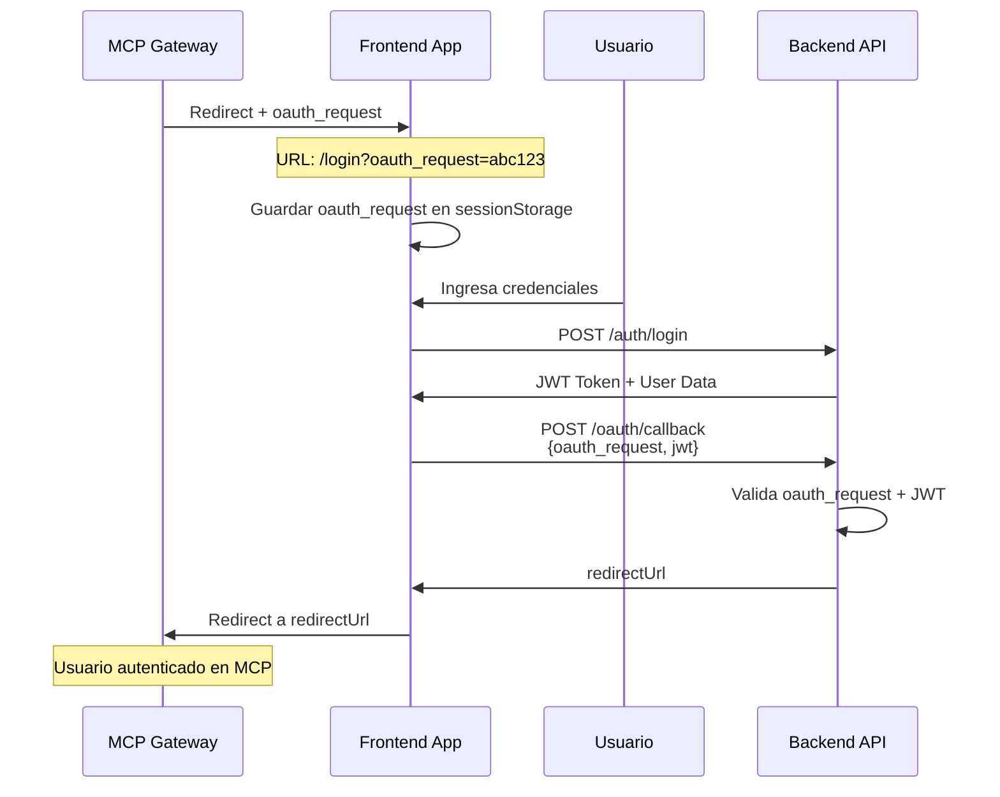

# Guía de Integración OAuth - Parámetro oauth_request

## 📋 Índice
1. [Descripción General](#descripción-general)
2. [Flujo de Autenticación OAuth](#flujo-de-autenticación-oauth)
3. [Implementación Frontend](#implementación-frontend)
4. [Endpoints Backend](#endpoints-backend)
5. [Ejemplos de Uso](#ejemplos-de-uso)
6. [Consideraciones de Seguridad](#consideraciones-de-seguridad)
7. [Troubleshooting](#troubleshooting)

---

## Descripción General

El parámetro `oauth_request` es un identificador único que permite vincular una solicitud OAuth iniciada por un servicio externo (MCP Gateway) con la sesión de autenticación del usuario en el frontend.

**Endpoint Backend:** `https://mcp-promps.onrender.com/oauth/callback`

### ¿Cómo funciona?

1. El servicio externo (MCP Gateway) genera un `oauth_request` único
2. Redirige al usuario al login del frontend con este parámetro en la URL
3. El usuario se autentica normalmente
4. El frontend envía el `oauth_request` + JWT al backend
5. El backend valida y completa el flujo OAuth
6. El usuario es redirigido de vuelta al servicio externo

---

## Flujo de Autenticación OAuth



---

## Implementación Frontend

### 1. Detección del Parámetro `oauth_request`

**Ubicación:** [src/pages/Login.tsx](src/pages/Login.tsx#L21-L29)

```typescript
useEffect(() => {
  const params = new URLSearchParams(window.location.search)
  const oauthRequest = params.get('oauth_request')
  
  if (oauthRequest) {
    // Guardar en sessionStorage para usarlo después del login
    sessionStorage.setItem('oauth_request', oauthRequest)
  }
}, [])
```

**¿Por qué sessionStorage?**
- ✅ Persiste durante la sesión de navegación
- ✅ No se envía automáticamente en requests HTTP
- ✅ Se limpia cuando se cierra la pestaña
- ✅ Disponible después del submit del formulario

### 2. Servicio de Autenticación OAuth

**Ubicación:** [src/services/authService.ts](src/services/authService.ts#L65-L67)

```typescript
export interface OAuthCallbackSuccess {
  status: 'success';
  redirectUrl: string;
}

export const authService = {
  async oauthCallback(
    oauthRequest: string, 
    jwtToken: string
  ): Promise<OAuthCallbackSuccess | ErrorResponse> {
    return api.post<
      { oauth_request: string; jwt: string }, 
      OAuthCallbackSuccess | ErrorResponse
    >(
      '/oauth/callback', 
      { 
        oauth_request: oauthRequest, 
        jwt: jwtToken 
      }
    );
  }
}
```

### 3. Flujo Completo en el Login

**Ubicación:** [src/pages/Login.tsx](src/pages/Login.tsx#L48-L82)

```typescript
async function handleSubmit(e: React.FormEvent) {
  e.preventDefault()
  setError(null)
  if (!validate()) return
  
  setLoading(true)
  try {
    // 1. Login normal del usuario
    const res = await authService.login(email, password)
    
    if (res.status === 'success') {
      const { token, user } = res
      saveAuth(token, user)
      
      // 2. Verificar si hay un oauth_request pendiente
      const oauthRequest = sessionStorage.getItem('oauth_request')
      
      if (oauthRequest) {
        try {
          // 3. Llamar al endpoint de OAuth callback
          const oauthRes = await authService.oauthCallback(oauthRequest, token)
          
          if (oauthRes.status === 'success') {
            // 4. Limpiar sessionStorage
            sessionStorage.removeItem('oauth_request')
            
            // 5. Redirigir a la URL del servicio externo
            window.location.href = oauthRes.redirectUrl
            return
          } else {
            // Si falla OAuth, continuar al dashboard normal
            console.error('OAuth callback failed:', oauthRes)
            sessionStorage.removeItem('oauth_request')
          }
        } catch (oauthErr) {
          // Si falla OAuth, continuar al dashboard normal
          console.error('OAuth callback error:', oauthErr)
          sessionStorage.removeItem('oauth_request')
        }
      }
      
      // 6. Navegación normal si no hay OAuth o si falló
      navigate('/dashboard')
    }
  } catch (err) {
    setError('Error de conexión')
  } finally {
    setLoading(false)
  }
}
```

---

## Endpoints Backend

### POST /oauth/callback

**URL Completa:** `https://mcp-promps.onrender.com/oauth/callback`

#### Request

```json
{
  "oauth_request": "abc123xyz789",
  "jwt": "eyJhbGciOiJIUzI1NiIsInR5cCI6IkpXVCJ9..."
}
```

#### Response Exitosa

```json
{
  "status": "success",
  "redirectUrl": "https://mcp-gateway.example.com/auth-complete?session=xyz"
}
```

#### Response de Error

```json
{
  "status": "error",
  "message": "Invalid oauth_request",
  "code": "INVALID_OAUTH_REQUEST"
}
```

### Validaciones del Backend

El backend debe validar:

1. ✅ **oauth_request existe** y es válido
2. ✅ **oauth_request no ha expirado** (típicamente 10-15 minutos)
3. ✅ **JWT es válido** y no ha expirado
4. ✅ **oauth_request no ha sido usado anteriormente** (prevenir replay attacks)
5. ✅ **Usuario del JWT tiene permisos** para acceder al servicio OAuth

---

## **Contrato Frontend-Backend**

Esta sección especifica de forma estricta cómo el frontend maneja `oauth_request` para que el backend pueda implementar y validar el endpoint `/oauth/callback` de forma compatible.

- Origen: el `oauth_request` lo genera el MCP Gateway y se añade como parámetro de query a la URL de login: `/login?oauth_request=<value>`.
- Detección (frontend): [src/pages/Login.tsx](src/pages/Login.tsx#L21-L29) lee `oauth_request` de la query y lo guarda en `sessionStorage` bajo la key `oauth_request`.
- Persistencia: se guarda exactamente la cadena recibida (sin procesamiento adicional). El frontend elimina `oauth_request` de `sessionStorage` tras procesarlo (éxito o error).
- Envío al backend: inmediatamente después de un login exitoso (o al montar si ya hay token) el frontend hace un POST JSON a `/oauth/callback` con el siguiente body:

  Request JSON:

  {
    "oauth_request": "<string>",
    "jwt": "<user_jwt_token>"
  }

- Headers esperados por el backend: `Content-Type: application/json`. Nota: el JWT se envía en el body (campo `jwt`) — el frontend no añade un header `Authorization` para este request.
- Respuesta exitosa esperada (200):

  {
    "status": "success",
    "redirectUrl": "https://..." // URL absoluta de redirección hacia el MCP Gateway
  }

- Respuesta de error (4xx/5xx):

  {
    "status": "error",
    "message": "Descripción legible",
    "code": "ERROR_CODE"
  }

- Códigos de error que el frontend maneja explícitamente (recomendado implementarlos en el backend):
  - `INVALID_OAUTH_REQUEST` — el `oauth_request` no existe o su formato es inválido.
  - `EXPIRED_OAUTH_REQUEST` — el `oauth_request` ha caducado.
  - `ALREADY_USED` — el `oauth_request` ya fue usado.
  - `INVALID_JWT` — JWT inválido o expirado.
  - `FORBIDDEN` — el usuario no tiene permisos para completar este OAuth.

- Comportamiento esperado del frontend según respuesta:
  - Si `status: 'success'` y `redirectUrl` está presente: el frontend elimina `oauth_request` de `sessionStorage` y redirige (`window.location.href = redirectUrl`).
  - Si `status: 'error'` o se produce excepción de red: el frontend elimina `oauth_request` y continúa con la navegación normal al dashboard (no reintenta automáticamente).

- Requisitos de seguridad para el backend:
  - Validar que `oauth_request` exista, no esté expirado y no haya sido usado.
  - Validar el `jwt`: firma, expiración y que el `sub`/usuario del token coincide con la cuenta que está autorizando.
  - Generar `redirectUrl` sólo hacia hosts permitidos o devolver un token/URL firmada para prevenir open-redirects.
  - Implementar protecciones anti-replay y límite de uso (un solo uso por `oauth_request`).
  - Responder con CORS apropiado permitiendo el origen del frontend y `Content-Type`.

- Ejemplo de `curl` que ilustra la llamada que hará el frontend:

  ```bash
  curl -X POST 'https://mcp-promps.onrender.com/oauth/callback' \
    -H 'Content-Type: application/json' \
    -d '{"oauth_request":"abc123xyz789","jwt":"<token>"}'
  ```

Incluye estos puntos en la implementación del backend para compatibilidad directa con el frontend actual.


## Ejemplos de Uso

### Ejemplo 1: Flujo OAuth Completo

```
1. Usuario intenta acceder a MCP Gateway sin autenticación
   URL del Gateway: https://mcp-gateway.example.com/protected

2. MCP Gateway genera oauth_request y redirige:
   https://tu-frontend.com/login?oauth_request=abc123xyz789

3. Usuario ingresa credenciales y hace login

4. Frontend detecta oauth_request y lo envía al backend:
   POST https://mcp-promps.onrender.com/oauth/callback
   Body: { "oauth_request": "abc123xyz789", "jwt": "..." }

5. Backend responde con redirectUrl:
   { "redirectUrl": "https://mcp-gateway.example.com/auth-complete?session=xyz" }

6. Frontend redirige al usuario de vuelta al MCP Gateway:
   window.location.href = redirectUrl

7. Usuario ahora está autenticado en ambos sistemas
```

### Ejemplo 2: Usuario ya autenticado

Si el usuario ya tiene una sesión válida en el frontend:

```typescript
// Verificar si hay token válido antes de mostrar login
useEffect(() => {
  const token = localStorage.getItem('authToken')
  const oauthRequest = sessionStorage.getItem('oauth_request')
  
  if (token && oauthRequest) {
    // Usuario ya autenticado, procesar OAuth directamente
    authService.oauthCallback(oauthRequest, token)
      .then(res => {
        if (res.status === 'success') {
          sessionStorage.removeItem('oauth_request')
          window.location.href = res.redirectUrl
        }
      })
  }
}, [])
```

### Ejemplo 3: Hook Reutilizable

Crear un hook personalizado para manejar OAuth:

```typescript
// src/hooks/useOAuthRequest.ts
import { useEffect, useState } from 'react'
import { useSearchParams } from 'react-router-dom'

export function useOAuthRequest() {
  const [searchParams] = useSearchParams()
  const [oauthRequest, setOauthRequest] = useState<string | null>(null)

  useEffect(() => {
    const oauth = searchParams.get('oauth_request')
    if (oauth) {
      sessionStorage.setItem('oauth_request', oauth)
      setOauthRequest(oauth)
      
      // Limpiar URL
      const newParams = new URLSearchParams(searchParams)
      newParams.delete('oauth_request')
      const newUrl = `${window.location.pathname}${
        newParams.toString() ? '?' + newParams.toString() : ''
      }`
      window.history.replaceState({}, '', newUrl)
    } else {
      const stored = sessionStorage.getItem('oauth_request')
      setOauthRequest(stored)
    }
  }, [searchParams])

  const clearOAuthRequest = () => {
    sessionStorage.removeItem('oauth_request')
    setOauthRequest(null)
  }

  return { oauthRequest, clearOAuthRequest }
}
```

Uso del hook:

```typescript
function LoginPage() {
  const { oauthRequest, clearOAuthRequest } = useOAuthRequest()
  
  // ... resto del componente
  
  const handleLoginSuccess = async (token: string) => {
    if (oauthRequest) {
      const res = await authService.oauthCallback(oauthRequest, token)
      if (res.status === 'success') {
        clearOAuthRequest()
        window.location.href = res.redirectUrl
        return
      }
    }
    navigate('/dashboard')
  }
}
```

---

## Consideraciones de Seguridad

### ✅ Implementado

1. **sessionStorage en lugar de localStorage**
   - Datos se eliminan al cerrar la pestaña
   - No persisten indefinidamente

2. **Limpieza después del uso**
   - `sessionStorage.removeItem('oauth_request')` después del callback
   - Previene reutilización accidental

3. **Manejo de errores**
   - Fallback al dashboard si OAuth falla
   - Usuario no queda bloqueado

### 🔒 Recomendaciones Adicionales

#### 1. Validación del Formato

```typescript
function isValidOAuthRequest(value: string): boolean {
  // Validar formato esperado (ej: UUID, alphanumeric, etc.)
  return /^[a-zA-Z0-9_-]{20,100}$/.test(value)
}

useEffect(() => {
  const params = new URLSearchParams(window.location.search)
  const oauthRequest = params.get('oauth_request')
  
  if (oauthRequest && isValidOAuthRequest(oauthRequest)) {
    sessionStorage.setItem('oauth_request', oauthRequest)
  }
}, [])
```

#### 2. Timeout del oauth_request

```typescript
interface StoredOAuthRequest {
  value: string
  timestamp: number
}

const OAUTH_TIMEOUT = 15 * 60 * 1000 // 15 minutos

function saveOAuthRequest(value: string) {
  const data: StoredOAuthRequest = {
    value,
    timestamp: Date.now()
  }
  sessionStorage.setItem('oauth_request', JSON.stringify(data))
}

function getOAuthRequest(): string | null {
  const stored = sessionStorage.getItem('oauth_request')
  if (!stored) return null
  
  try {
    const data: StoredOAuthRequest = JSON.parse(stored)
    const age = Date.now() - data.timestamp
    
    if (age > OAUTH_TIMEOUT) {
      sessionStorage.removeItem('oauth_request')
      return null
    }
    
    return data.value
  } catch {
    sessionStorage.removeItem('oauth_request')
    return null
  }
}
```

#### 3. HTTPS Obligatorio

```typescript
// Verificar que OAuth solo funcione en HTTPS (excepto localhost)
useEffect(() => {
  const isSecure = window.location.protocol === 'https:' ||
                   window.location.hostname === 'localhost'
  
  if (!isSecure) {
    console.warn('OAuth requires HTTPS connection')
    sessionStorage.removeItem('oauth_request')
  }
}, [])
```

#### 4. Content Security Policy (CSP)

Añadir en `index.html`:

```html
<meta http-equiv="Content-Security-Policy" 
      content="default-src 'self'; 
               connect-src 'self' https://mcp-promps.onrender.com;
               form-action 'self';">
```

#### 5. Rate Limiting

```typescript
// Limitar intentos de OAuth callback
import { useCooldown } from '../hooks/useCooldown'

function LoginPage() {
  const { canProceed, markAttempt } = useCooldown(
    'oauth_callback',
    3, // max 3 intentos
    60000 // en 1 minuto
  )
  
  const handleOAuthCallback = async () => {
    if (!canProceed()) {
      setError('Demasiados intentos. Espera un momento.')
      return
    }
    
    markAttempt()
    // ... resto del código
  }
}
```

---

## Troubleshooting

### Problema: oauth_request no se guarda

**Causa:** El useEffect puede ejecutarse después de que la URL cambie

**Solución:**
```typescript
// Leer antes del render
const getInitialOAuthRequest = () => {
  const params = new URLSearchParams(window.location.search)
  return params.get('oauth_request')
}

const [oauthRequest] = useState(getInitialOAuthRequest)

useEffect(() => {
  if (oauthRequest) {
    sessionStorage.setItem('oauth_request', oauthRequest)
  }
}, [oauthRequest])
```

### Problema: Redirect loop infinito

**Causa:** El oauth_request no se limpia después del callback

**Solución:**
```typescript
// Siempre limpiar antes de redirigir
sessionStorage.removeItem('oauth_request')
window.location.href = redirectUrl
```

### Problema: Error 401 en /oauth/callback

**Causas posibles:**
1. JWT expirado
2. oauth_request inválido o expirado
3. oauth_request ya utilizado

**Solución:**
```typescript
try {
  const oauthRes = await authService.oauthCallback(oauthRequest, token)
  // ... success
} catch (err) {
  if (err.code === 'EXPIRED_OAUTH_REQUEST') {
    setError('El enlace de OAuth ha expirado. Por favor, inicia el proceso nuevamente.')
    sessionStorage.removeItem('oauth_request')
  } else if (err.code === 'INVALID_JWT') {
    // Re-login necesario
    clearAuth()
    setError('Sesión expirada. Por favor, ingresa tus credenciales nuevamente.')
  }
}
```

### Problema: redirectUrl no se carga

**Causa:** CSP o CORS bloquea la redirección

**Solución:**
```typescript
// Validar que redirectUrl sea seguro
function isValidRedirectUrl(url: string): boolean {
  try {
    const parsed = new URL(url)
    const allowedHosts = [
      'mcp-gateway.example.com',
      'mcp-promps.onrender.com'
    ]
    return allowedHosts.includes(parsed.hostname)
  } catch {
    return false
  }
}

if (oauthRes.status === 'success') {
  if (isValidRedirectUrl(oauthRes.redirectUrl)) {
    window.location.href = oauthRes.redirectUrl
  } else {
    console.error('Invalid redirect URL:', oauthRes.redirectUrl)
    navigate('/dashboard')
  }
}
```

### Problema: Usuario se pierde en el flujo

**Causa:** Falta feedback visual durante el proceso OAuth

**Solución:**
```typescript
const [oauthStatus, setOauthStatus] = useState<'idle' | 'processing' | 'redirecting'>('idle')

const handleOAuthCallback = async () => {
  setOauthStatus('processing')
  
  try {
    const res = await authService.oauthCallback(oauthRequest, token)
    
    if (res.status === 'success') {
      setOauthStatus('redirecting')
      // Mostrar mensaje al usuario
      await new Promise(resolve => setTimeout(resolve, 1000))
      window.location.href = res.redirectUrl
    }
  } catch (err) {
    setOauthStatus('idle')
    setError('Error en OAuth')
  }
}

// En el JSX
{oauthStatus === 'processing' && (
  <div className="text-center text-cyan-400">
    Procesando autenticación OAuth...
  </div>
)}

{oauthStatus === 'redirecting' && (
  <div className="text-center text-green-400">
    ✓ Autenticación exitosa. Redirigiendo...
  </div>
)}
```

---

## Resumen del Flujo

| Paso | Acción | Ubicación | Responsable |
|------|--------|-----------|-------------|
| 1 | Generar `oauth_request` | MCP Gateway | Backend Externo |
| 2 | Redirect a `/login?oauth_request=...` | URL | Backend Externo |
| 3 | Detectar parámetro y guardar en sessionStorage | `useEffect` | Frontend |
| 4 | Usuario hace login | Formulario | Frontend + Backend |
| 5 | Verificar sessionStorage | `handleSubmit` | Frontend |
| 6 | POST `/oauth/callback` con oauth_request + JWT | API call | Frontend → Backend |
| 7 | Validar y generar redirectUrl | Backend | Backend |
| 8 | Redirigir a redirectUrl | `window.location.href` | Frontend |
| 9 | Completar OAuth y autenticar al usuario | MCP Gateway | Backend Externo |

---

## Referencias

- **Archivo de servicio:** [src/services/authService.ts](src/services/authService.ts)
- **Página de login:** [src/pages/Login.tsx](src/pages/Login.tsx)
- **Hook de token URL:** [src/hooks/useTokenFromUrl.ts](src/hooks/useTokenFromUrl.ts)
- **Hook de cooldown:** [src/hooks/useCooldown.ts](src/hooks/useCooldown.ts)
- **Endpoint Backend:** `https://mcp-promps.onrender.com/oauth/callback`

---

**Última actualización:** Marzo 2026
