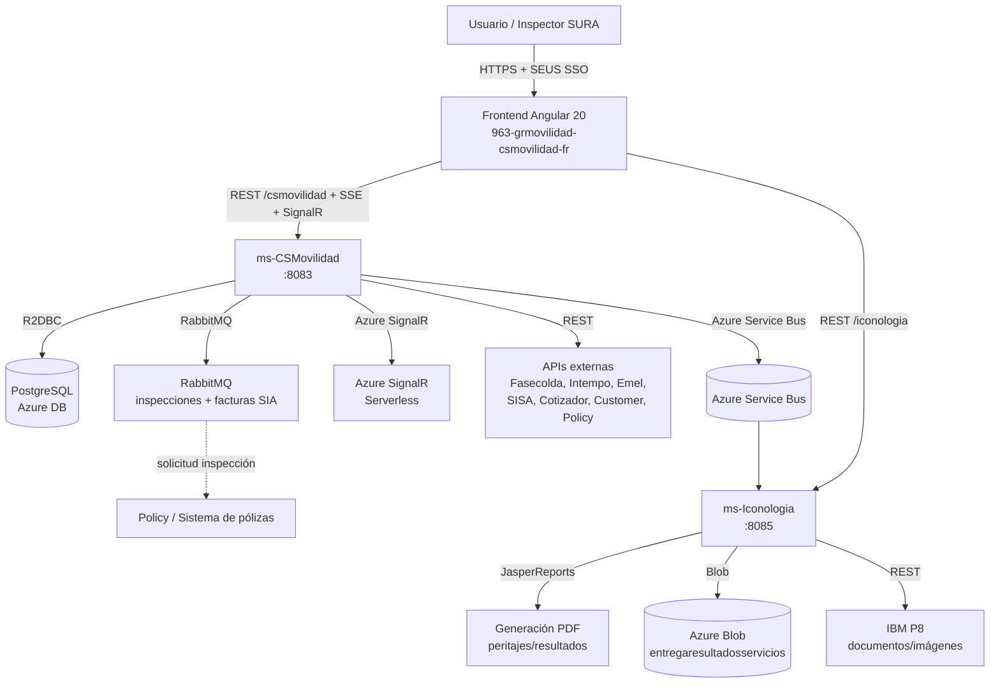
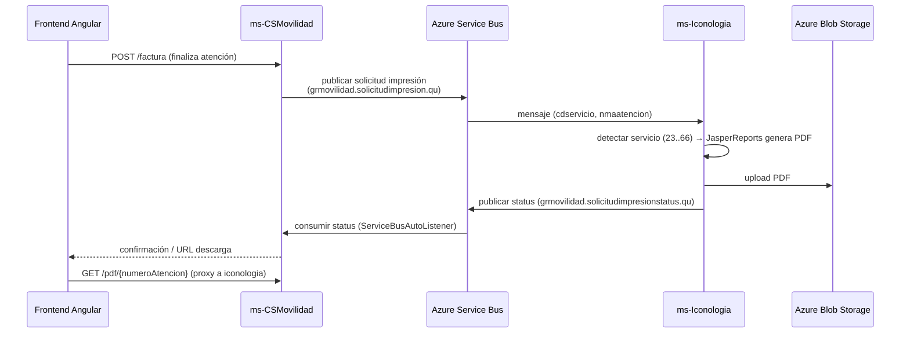

# Informe de Arquitectura — Ecosistema GR Movilidad (SURA)

**Fecha:** 04/08/2026
**Preparado para:** Arquitectura de Software
**Ámbito:** Análisis profundo de los 3 repositorios del ecosistema de Gestión y Prestación de Servicios de Movilidad de Seguros Sura.

---

## 1. Resumen Ejecutivo

El ecosistema **GR Movilidad** centraliza la gestión de servicios de movilidad e inspecciones automotrices de Seguros Sura (Peritaje / Asegurabilidad / Prestación de Servicios). Está compuesto por **3 repositorios**:

| Proyecto | Rol | Stack | Puertos (HTTP/colas) |
|---|---|---|---|
| `963-grmovilidad-csmovilidad-ms` | **Microservicio principal** — flujo completo de inspección (atenciones, servicios, actividades, facturación SAP, inspectores, administración, monitor de tiempos en tiempo real) | Spring Boot 3.5.14, Java 21, WebFlux (reactivo puro), R2DBC PostgreSQL, RabbitMQ, Azure Service Bus, Azure SignalR, SSE, Caffeine, Resilience4j | HTTP `:8083` `/csmovilidad`, colas RabbitMQ |
| `963-grmovilidad-iconologia-ms` | **Microservicio de "Iconología"** — generación de PDFs/reportes (JasperReports) de peritajes, almacenamiento en Azure Blob y orquestación vía mensajería | Spring Boot 3.4.5, Java 21, WebFlux, JasperReports 6.21, Azure Storage Blob, Azure Service Bus, Caffeine, Jasypt | HTTP `:8085` `/iconologia`, Azure Service Bus |
| `963-grmovilidad-csmovilidad-fr` | **Frontend SPA** — interfaz de usuario de todo el ecosistema (gestión de atenciones, servicios, formularios dinámicos FormIO, monitor de tiempos) | Angular 20, TypeScript 5.8, PrimeNG, Bootstrap, RxJS, FormIO, SignalR, SSE | SPA estático (Blob + CDN), consume ambos microservicios |

**Patrón arquitectónico dominante:** Arquitectura Hexagonal / Clean Architecture (Ports & Adapters) en los 3 proyectos, con programación reactiva (Reactor) en backend y RxJS en frontend. El frontend añade Atomic Design y modularización con Lazy Loading.

---

## 2. Visión General del Ecosistema (Cómo se conectan)

```
                          +----------------------------------------------------+
                          |              FRONTEND (Angular 20 SPA)             |
                          |              963-grmovilidad-csmovilidad-fr        |
                          |   Módulos lazy-loaded + standalone + Atomic Design |
                          +--------------------------+-------------------------+
                                                     | HTTPS REST + SSE + SignalR (WebSocket)
                              +----------------------+----------------------+
                              |                                             |
                    +---------v--------+                        +-----------v----------+
                    |   ms-CSMovilidad  |                        |  ms-Iconologia       |
                    |  (principal)      |                        |  (reportes/PDFs)     |
                    |  :8083 /csmovilidad|                       |  :8085 /iconologia    |
                    +---------+---------+                        +-----------+----------+
                              |                                             |
          +-------------------+------------------+                         |
          |  Postgres R2DBC | RabbitMQ | Azure SB | Azure SignalR |       |
          |  Blob Storage  | REST externos        |                |       |
          +-------------------+------------------+                         |
                              |                                             |
                              |  Azure Service Bus (mensajería asíncrona)   |
                              +---------------------+-----------------------+
                                                    |
                                          Colas grmovilidad.solicitudimpresion.*
                                          (iconologia recibe solicitudes, publica status)
```

### Flujo de conexión principal

1. **Usuario** interactúa con el **frontend Angular**, que se autentica contra **SEUS (SSO corporativo Sura)**.
2. El frontend consume la **API REST reactiva** de `ms-CSMovilidad` (prefijo `/csmovilidad`) para el negocio principal y la de `ms-Iconologia` (prefijo `/iconologia`) para descarga de PDFs de resultados.
3. **`ms-CSMovilidad`** es la puerta de entrada: recibe solicitudes de inspección desde **RabbitMQ** (cola `seguros.solicitud.inspeccion.grmovilidad.q`, proveniente del sistema de pólizas/Policy), procesa facturas vía **SIA** (colas `...bandeja.q` / `...legalizada.q`), e integra con APIs externas (Fasecolda, Intempo, Emel, SISA, cotizador, customer, notification).
4. Para la generación de **PDFs de resultados/peritajes**, `ms-CSMovilidad` publica un mensaje en **Azure Service Bus** (cola `grmovilidad.solicitudimpresion.qu`). **`ms-Iconologia`** consume ese mensaje, genera el PDF con **JasperReports**, lo sube a **Azure Blob Storage**, y publica el estado en la cola de status (`grmovilidad.solicitudimpresionstatus.qu`), que a su vez es consumida por `ms-CSMovilidad` (Service Bus receiver).
5. El **monitor de tiempos en tiempo real** usa **Azure SignalR Service (Serverless)**: el frontend negocia conexión con `ms-CSMovilidad` (`POST /api/v1/monitor/negotiate`), obtiene credenciales JWT, y recibe eventos push. Complementariamente existe streaming por **SSE** para actividades.

```
SECUENCIA: Atención → Impresión de resultado
Frontend --POST /factura--> csmovilidad --publica SB--> [grmovilidad.solicitudimpresion.qu]
                                                        → iconologia consume
                                                        → genera PDF (JasperReports)
                                                        → sube a Blob Storage
                                                        → publica status [grmovilidad.solicitudimpresionstatus.qu]
                                                        → csmovilidad consume → responde al frontend
```

---

## 3. Análisis por Proyecto

---

### 3.1 `963-grmovilidad-csmovilidad-ms` — Microservicio Principal

**Ubicación:** `C:\Users\jdurrego\Documentos\963-grmovilidad-csmovilidad-ms`

#### 3.1.1 Propósito / Funcionalidad de Negocio

Microservicio **reactivo puro** que orquesta el ciclo de vida de una **atención de inspección automotriz** de principio a fin:

- **Atenciones**: creación, búsqueda paginada (operador/admin), cancelación, reinspection (reinspecciones de atenciones rechazadas), búsqueda por placa de servicios pendientes.
- **Servicios por atención**: consulta de servicios, servicios complementarios, scoring renting (código 66), estrategias de servicios y actividades (Strategy pattern: p8, base, expertise, factory, generic, inspection, notification, policy, renting).
- **Actividades**: CRUD, actividades disponibles por servicio/atención, streaming SSE de actividades.
- **Facturación**: integración SIA → SAP, órdenes de trabajo SAP, transferencia de inventario, contingencia (facturación offline cuando SAP no está disponible) con reconciliación.
- **Cliente/vehículo**: consulta de clientes, cliente de facturación por DNI (con caché), información de vehículo (placa, Fasecolda, kilometraje, Emel, valoración de cotización).
- **Administración**: inspectores (CRUD), permisos/funcionalidades, plantillas de formularios (FormIO), calificativos y categorías, convenios, centros de servicio, catálogo de servicios.
- **Formularios dinámicos**: CRUD de formularios FormIO, asociaciones, descarga de plantillas/catálogo/Excel, conversión CSV → JSON FormIO.
- **Monitor de tiempos en tiempo real ("Torre de Control")**: seguimiento del tiempo de ejecución de cada actividad/servicio por centro de servicio, snapshot en caché Caffeine, eventos push vía Azure SignalR.

#### 3.1.2 Arquitectura y Estructura (Hexagonal multi-módulo Gradle)

```
963-grmovilidad-csmovilidad-ms/
├── domain/
│   ├── model/               # Entidades, Ports In/Out, Gateways (sura.csmovilidad.domain.*)
│   │   ├── attention/  client/  vehicle/  customer/  invoice/  activity/
│   │   ├── monitor/    servicecenter/  inspector/  admin/  formulario/
│   │   ├── contingencia/  renting/  scoring/  article/  alert/  depreciation/
│   │   ├── legalstudy/  notification/  iconologia/  pdf/  rabbit/  reinspection/
│   │   └── servicesandactivitiesstrategy/
│   └── usecase/             # Lógica de negocio @Service que implementa Ports In
│       └── activity/ accessorylist/ workorder/ invoice/ attention/ vehicle/
│           customer/ client/ servicescenter/ inspector/ admin/ formulario/
│           contingencia/ reinspection/ renting/ scoring/ article/ alert/
│           depreciation/ legalstudy/ notification/ iconologia/ pdf/ rabbit/
│           monitor/ servicesandactivitiesstrategy/
├── applications/
│   └── app-service/         # Composición final (Main, config, resources, Dockerfile)
├── infraestructure/
│   ├── entry-points/        # Driving Adapters (entrada)
│   │   ├── reactive-web/          # 41 Routers + 47 Handlers WebFlux funcionales
│   │   ├── rabbit-reactive-mq/    # Listeners RabbitMQ reactivos (policy, bandeja, legalizada)
│   │   └── rabbit-mq-md/          # Placeholder (solo build.gradle, spring-boot 2.5.3)
│   └── driven-adapters/     # Driven Adapters (salida)
│       ├── r2dbc-postgresql/      # ~100 clases (repositorios R2DBC)
│       ├── remote-repository/     # Consumidores REST externos
│       ├── storage-repository/    # Azure Blob Storage
│       ├── signalr-adapter/       # Azure SignalR Serverless (NUEVO - monitor)
│       ├── broker-repository/     # SSE broadcaster + BrokerAdapter
│       ├── async-messages-sender/ # Azure Service Bus
│       └── sse-streaming/         # Streaming SSE
├── infraestructure/helpers/  # módulos comunes reutilizables
│   ├── r2dbc-repository-commons/   # Base AdapterOperations
│   ├── rabbit-mq-reactive-commons/ # AbstractRabbitMqListener + RabbitMQProducer
│   ├── rabbit-mq-repository-commons/ # Config/deserialización
│   ├── service-bus-commons/        # Serialización DTOs Service Bus
│   └── formio-converter/           # CSV → JSON FormIO
├── test/acceptance/         # Prueba de aceptación reactiva (async-commons)
└── docs/                    # ADRs, propuestas, diagramas C4
```

#### 3.1.3 Stack Tecnológico

| Componente | Versión | Nota |
|---|---|---|
| Java / Spring Boot | 21 / 3.5.14 | Spring Cloud 2025.0.2 |
| Modelo | WebFlux reactivo puro | Mono/Flux end-to-end, sin servlets |
| Persistencia | R2DBC PostgreSQL | `spring-boot-starter-data-r2dbc` |
| Mensajería | reactor-rabbitmq + Azure Service Bus + Spring AMQP | |
| Realtime | Azure SignalR Service Serverless (JWT JJWT 0.12.6) + SSE | |
| Seguridad | SEUS SSO Sura (`ssosura-java-reactive-17`) `@EnableReactiveSuraSecurity` | |
| Caché | Caffeine | Decisión ADR-002/003 (no Redis) |
| Resiliencia | Resilience4j Circuit Breaker | 3 instancias: `consulta-clientes`, `sisa-service-fasecolda`, `intempo-service` |
| Cifrado config | Jasypt (PBEWithMD5AndDES) | Credenciales `ENC(...)` |
| Documentación | springdoc-openapi (WebFlux) | `@RouterOperation` en routers |
| Build/CI | Gradle multi-módulo, Jacoco, SonarQube | Azure Pipelines + Jenkinsfile |

#### 3.1.4 Ejemplos de Ports (Contratos de Dominio)

- **Ports In** (implementados por Use Cases): `ComplementaryServiceQueryPortIn`, `VehicleInterfacePortIn`, `GetCustomerServicePortIn`, `CreateReinspectionPortIn`, `ServiceInterfacePortIn`, `SendImageIdsRentingPortIn`, `ClientInterfacePortIn`, `SendResponsePolicyInterfacePortIn`, `SearchAttentionByIdPortIn`, `ClientServicePortIn` (facturación), y para el monitor: `StartActivityPortIn`, `MonitorSnapshotCachePortIn`, `AttentionServiceActivityPortIn`.
- **Ports Out / Gateways** (implementados por adapters): `ClientRepositoryPortOut`, `VehicleRepositoryPortOut`, `ServiceCenterRepositoryPortOut`, `AttentionGateway`, `AttentionRepository`, `ServiceRepository`, `ServiceActivitiesRepository`, `RabbitMQGateway` (+ Consumer), `MonitorRealTimePortOut`, `MonitorNegotiatePortOut`, `MonitorSnapshotRepositoryPortOut`, `MonitorTimeTrackingPortOut`, `StorageRepository`, `ServiceBusSender`, `ReportServicioAtencionPortOut`, `InfoAttentionToPdfPort`, `CsvToFormioConverterPortOut`.

#### 3.1.5 Endpoints REST principales

**Monitor de tiempos (nuevo):**
- `GET /api/v1/monitor/snapshot` — snapshot de actividades en curso (Caffeine TTL 15s).
- `GET /api/v1/monitor/inspector/centro-servicio` — inspectores nacionales o por DNI.
- `POST /api/v1/monitor/negotiate` — negociación de conexión SignalR (devuelve URL/token/group).
- `POST /api/v1/actividad/iniciar` — inicio de actividad (estados, bloqueo por reglas).

**Atención y servicios:**
- `POST /attention` · `GET /atencion/busqueda-paginada` · `GET /atencion/admin/busqueda-paginada`
- `GET /atencion/{id}/servicio/{codigo}/scoring-renting` · `GET/POST /atencion/servicios-complementarios*`
- `GET /actividades/disponibles/atencion/{id}/servicio/{codigo}/sntieneAccesorios/{bool}`
- `GET /actividad/stream/atencion/{id}/servicio/{codigo}` — SSE stream.
- `GET /servicios-pendientes/{plate}` · `GET /gestion-clientes` · `GET /peritaje/estudio-legal?placa=`

**Facturación / OT:**
- `POST /factura` · `GET/PUT /facturacion/obtener-persona-facturar/{billingDni}` · `PUT /facturacion/actualizar-persona-facturar/{clientDni}`
- `POST /orden-trabajo` · `GET /orden-trabajo/articulos/filtros` · `GET /orden-trabajo/articulos/disponibilidad`
- Contingencia: `/configuracion/contingencia-sap|imagenes|intempo` (GET/PUT), `/factura/{nmatencion}/cerrar-contingencia`, `/factura/pendientes-reconciliacion`, `/factura/reconciliar-contingencia`

**Administración:**
- `/admin/inspectores*` · `/permisos*` · `/funcionalidades` · `/creacion-plantilla*` · `/plantillas/{categoryCode}` · `/formularios/**` (12 endpoints) · `/calificativo*` · `/categoria*` · `/categorias-calificativos*` · `/convenio*` · `/centros-de-servicio` · `/gestion-centros-servicio`

**Otros:** `/pdf/{numeroAtencion}` (iconologia) · `/reporte/servicios-atencion/csv` (máx 4 meses) · `/evaluaciones-renting/**` · `/api/servicebus/send|receive`.

#### 3.1.6 Mensajería (RabbitMQ / Azure Service Bus)

| Listener | Cola / Exchange | Función |
|---|---|---|
| `GetPolicyAttentionRabbitListener` | `seguros.solicitud.inspeccion.grmovilidad.q` | Solicitudes de inspección desde sistema de pólizas → crea atención |
| `RabbitMQListener` (consumeAutoAck) | `seguros.sia.factura.grmovilidad.bandeja.q` y `...legalizada.q` | Facturas SIA → Tray / Legalized |
| `ServiceBusAutoListener` | `grmovilidad.solicitudimpresionstatus.qu` (receiver) | Estados de impresión PDF desde iconologia |
| `RabbitMQProducer` | Exchange `seguros.respuesta.inspeccion.policy` | Respuestas/notificaciones hacia Policy |

Base técnica: `AbstractRabbitMqListener<E,P,U>` con `consumeManualAck`, prefetch, ack/nack con requeue, **retry backoff infinito 5→60s**, auto-recovery NIO, `Schedulers.boundedElastic`.

#### 3.1.7 Real-time: Azure SignalR (ADR-003)

- **Decisión (ACEPTADO 2026-04-13):** Azure SignalR Service Serverless en lugar de SSE/WebSocket/RabbitMQ fanout. Justificación: soporte multi-pod stateless, costo ~$55-65/mes. Requiere LEGO IaC (pendiente).
- Hub por defecto `monitor`, grupo `centro:{centroServicio}`.
- `SignalRTokenGenerator` (JJWT HMAC-SHA256): token servidor (aud=URL REST, exp 300s) y token cliente (claim `nameid` = DNI, exp 3600s).
- `AzureSignalRAdapter` implementa `MonitorRealTimePortOut` + `MonitorNegotiatePortOut`: `emitEvent` → POST `/groups/{centro}`, `addUserToGroup`, `generateCredentials`.
- **SSE aún activo** (`sse.activities.enabled=true`) para el streaming de actividades — documentado como limitación a 1 pod (riesgo de convergencia con SignalR).

#### 3.1.8 Persistencia R2DBC (monitor)

- `MonitorTimeTrackingRepositoryAdapter`: `DatabaseClient` con SQL crudo sobre `TCSM_ATEN_SERV_ACTI` y `TCSM_SERVICIOS_X_ATENCION`, upsert `ON CONFLICT`, registro inicio/fin actividad, cierre de servicio con SLA.
- `MonitorSnapshotRepositoryAdapter`: JOIN de 6 tablas (`TCSM_ATENCIONES`, `TCSM_VEHICULOS`, `TCSM_SERVICIOS_X_ATENCION`, `TCSM_SERVICIOS`, `TCSM_SERV_ACTIVIDADES`, `TCSM_ACTIVIDADES` + left join `TCSM_ATEN_SERV_ACTI` y `TCSM_INSPECTORES`), dos pasos con `IN` dinámico.
- ⚠️ Requiere ALTERs DBA para columnas nuevas (`FEINICIO_EJECUCION`, `FEFIN_EJECUCION`, `NMDURACION_SEGUNDOS`) — prerrequisito pendiente.

#### 3.1.9 Buenas prácticas detectadas

- **Hexagonal consistente**: dominio sin dependencias de Spring; ports in/out en dominio, adapters en infraestructura.
- **DTOs separados de entidades de dominio**; mappers (ej. `ClientInfoMapper.toDto(ClientT)`).
- **Manejo de errores reactivo** con mapeo 4xx→`SERVICE_CLIENT_ERROR`, 5xx→`SERVICE_SERVER_ERROR` en base `Consumer`.
- **Circuit Breaker** con Resilience4j configurado por properties en servicios externos críticos.
- **Caché Caffeine** (peticiones repetidas a terceros).
- **ADRs**: decisiones documentadas (ADR-002, ADR-003) — buena práctica de arquitectura.
- **Logging** asíncrono Log4j2 + Splunk (CustomLevels CRITICAL/LEGAL/PROCESS).

#### 3.1.10 Observaciones / Riesgos para el arquitecto

1. **Módulo `rabbit-mq-md` huérfano** (solo build.gradle con Spring Boot 2.5.3, sin código) — candidato a eliminación o migración.
2. **Doble fuente de realtime**: SSE (actividades) y SignalR (monitor). Evaluar convergencia si el monitor reemplaza el turnero SSE.
3. **Tres mecanismos de manejo de errores** (ControllerExceptionHandler, GlobalErrorHandler, GlobalExceptionFilter) — conviene unificar el contrato de errores.
4. **Monitor con SQL crudo** en DatabaseClient: correcto en reactivo pero exige cuidado en binding de parámetros y migraciones DBA.
5. **Caché Caffeine en UseCase de snapshot**: deliberado (ADR-002), pero con 2+ pods cada pod tiene snapshot propio (mitigado: invalidación tras cada start).
6. **Falta cobertura de tests** para flujos nuevos críticos (monitor, contingencia) — gap de calidad señalado por ADR-003.
7. **Azure SignalR requiere LEGO IaC** que aún no está en catálogo (riesgo de plataforma).

---

### 3.2 `963-grmovilidad-iconologia-ms` — Microservicio de Reportes / PDFs

**Ubicación:** `C:\Users\jdurrego\Documentos\963-grmovilidad-iconologia-ms`

#### 3.2.1 Propósito / Funcionalidad de Negocio

**"Iconología"** es el microservicio encargado de la **generación y entrega de resultados documentales (PDFs) de los peritajes/inspecciones** de movilidad:

- Genera **reportes PDF formateados con la imagen corporativa SURA** (fuentes SuraSans embebidas) mediante **JasperReports** (~28 plantillas `.jrxml` + sub-reportes).
- Cubre 3 familias de documentos según **código de servicio**:
  - **Revisión general/maestra** (master_pdf): códigos **23, 24, 43, 44, 45, 46, 47, 65**.
  - **Mantenimiento**: códigos **49, 51, 53**.
  - **Renting**: código **66**.
- **Mapea imágenes con coordenadas** (carrocería, chasis, moto) según tipo de vehículo (combustión, diésel, eléctrico, híbrido) en los reportes.
- **Almacena los PDFs en Azure Blob Storage** (container `entregaresultadosservicios`) y permite su **descarga** (`GET /documento/download/{documentId}`).
- Se integra con **IBM P8** para búsqueda/descarga de documentos e imágenes de motores.
- Procesa **mensajes de Azure Service Bus** (solicitud de impresión) y publica el **estado** (impresión OK/error).
- Gestiona un **flujo de tareas** (crear → asignar → completar → reasignar) con una **tarea programada diaria a las 17:00** que crea tareas automáticamente.

#### 3.2.2 Arquitectura y Estructura (Hexagonal multi-módulo Gradle)

```
963-grmovilidad-iconologia-ms/
├── domain/
│   ├── model/               # Entidades + ports (sura.iconologia.domain.*)
│   │   ├── masterpdf/entity/    # Master, Service, Vehicle, EngineImage, ImageTakingActivity,
│   │   │                        #   Attention, Client, LegalStudy, BoxAndEngine
│   │   ├── maintenance/entity/  # MaintenanceMaster (~30 actividades tipadas)
│   │   ├── renting/entity/      # RentingMaster, RentingActivity, RentingScoring
│   │   ├── pdfblob/entity/      # BlobHandle, DocumentType, OperationType
│   │   ├── p8/document/         # DocumentData, DocumentProperty, ...
│   │   ├── todo/ (+ events)     # Task, TaskToDo, TaskCreated, TaskAssigned, TaskCompleted
│   │   ├── servicebus/port/     # receiver | sender
│   │   ├── common/              # ApplicationLogger, EventsGateway, UniqueIDGenerator, UserInfo...
│   │   └── exception/           # ExceptionUseCase, MissingRequiredFieldException...
│   └── usecase/             # Casos de uso
│       ├── masterpdf/  maintenance/  renting/  pdf/  p8/  servicebus/  todo/
│       └── (util/ observation/ detectors...)
├── applications/
│   └── app-service/         # Main, UseCaseConfig, CacheConfig, LoggerConf, resources
├── infraestructure/
│   ├── entry-points/
│   │   ├── reactive-web/         # REST: HealthService, DocumentService, PdfRouter, TaskServices
│   │   └── scheduler/            # Tarea diaria @Scheduled 17:00
│   └── driven-adapters/
│       ├── jasper-repository/        # Generación PDF (JasperReports + strategies)
│       ├── azure-storage-repository/ # Persistencia PDF en Blob Storage
│       ├── remote-repository/        # Cliente WebClient a IBM P8
│       ├── async-messages-sender/    # Azure Service Bus sender/receiver
│       └── jpa-repository/           # (base JPA)
├── infraestructure/helpers/
│   ├── azure-storage-commons/   # BlobStorageServiceBase, BlobStorageProperty
│   ├── jpa-repository-commons/
│   └── service-bus-commons/     # Serialización DTOs Service Bus
├── test/acceptance/         # Prueba reactiva (reactivecommons)
└── scripts/, docs/          # vacíos
```

#### 3.2.3 Stack Tecnológico

| Componente | Versión |
|---|---|
| Java / Spring Boot | 21 / 3.4.5 (Spring Cloud 2024.0.1) |
| Modelo | WebFlux + Reactor 2024.0.6 |
| Reportes | JasperReports 6.21.2 + jasperreports-fonts (SuraSans embebida) |
| Storage | Azure Storage Blob 12.30.1 |
| Mensajería | Azure Service Bus 7.17.8 |
| Caché | Caffeine 3.2.0 |
| Cifrado | Jasypt 3.0.5 (PBEWithMD5AndDES) |
| Docs | Springdoc OpenAPI WebFlux 2.8.6 |
| Lombok | 1.18.36 |
| Charts | jfreechart 1.5.5 (gráficos en reportes) |

#### 3.2.4 Generación de Reportes JasperReports (detalle)

- **~28 plantillas** en `jasper-repository/src/main/resources/jrxml/`: `master_report.jrxml`, `maintenance_report.jrxml`, `master_renting_report.jrxml`, y sub-reportes (`subBodyWork`, `subScanner`, `subAlineacion`, `subBalanceo`, `subRouteTest`, `subBasicMotorcycleInspection`, `subBasicAppraisalReport`, `subLegalStudyRenting`, `subSeguridadPasivaActiva`, `subServiceSummary`, etc.).
- Compilación en build (`compileJasperReports`) hacia `app-service/build/resources/main/jasper/`.
- **Patrón Strategy** para elegir el generador por código de servicio:
  - `CompleteCarReviewPdfGenerationStrategy` (43, 44) · `PdfGenerationStrategyGeneric` (23, 24, 45, 46, 47, 65) · `StandardMaintenancePdfStrategy` (49, 51, 53) · renting (66).
- **Base común** `JasperServiceBase`: semáforo `MAX_CONCURRENT_REPORTS=1`, `JRSwapFileVirtualizer` (22 páginas), compilación `.jrxml` si falta, `subscribeOn(boundedElastic)`.
- Procesadores de imágenes por coordenadas en `service/imagecoordinates/`.
- Config `JasperReportsConfig`: compilador `JRJdtCompiler`, caché de imágenes, subreport threads.

#### 3.2.5 Mensajería Azure Service Bus

- Colas reales: `grmovilidad.solicitudimpresionstatus.qu` (**envío** de status) y `grmovilidad.solicitudimpresion.qu` (**recepción** de solicitudes).
- Config: `maxRetries=3`, `retryDelay=1000`, `maxConcurrentCalls=5`, `receiveTimeout=30000`.
- Payload con `cddocumento` / `cdservicio` / `nmaatencion`.
- Detección de mensaje por `service.codigo_servicio`: `MaintenanceMessageDetector` (49, 51, 53), `RentingMessageDetector` (66).

#### 3.2.6 Endpoints REST

- `GET /health` — health check.
- `GET /documento/download/{documentId}` — descarga PDF (`application/pdf` attachment) vía RouterFunction.
- `POST /task` · `POST /task/assign` · `POST /task/{id}/complete` · `GET /task` · `GET /task/{id}`.
- `DocumentService` (@RestController) con validación de Base64 (máx 5 MB).
- Context path `/iconologia`, puerto **8085**.

#### 3.2.7 Buenas prácticas detectadas

- **Hexagonal estricta**: dominio sin anotaciones de framework (solo Lombok), validado por script `.github/scripts/arch-validate.sh`.
- **Patrón Strategy** para variantes de generación de PDF por servicio.
- **Caché Caffeine** para peticiones recurrentes a P8.
- **Eventos de dominio** (TaskCreated/TaskAssigned/TaskCompleted) + reactivecommons.
- **Manejo de errores centralizado**: `ControllerExceptionHandler` (@ControllerAdvice) + `ErrorHandler`.
- **128 archivos de prueba** (JUnit 5, Mockito, Reactor Test) con amplia cobertura en use cases y adapters.
- **Jasypt** para credenciales P8/Service Bus (`ENC(...)`), password en runtime por JVM arg.
- **Retry/backoff** manual en listener Service Bus y semáforo en Jasper (sin Resilience4j en este proyecto).

#### 3.2.8 Observaciones / Riesgos

1. Sin Resilience4j (reintentos manuales); evaluar homogeneizar resiliencia con el MS principal.
2. Reportes single-thread (semáforo MAX_CONCURRENT_REPORTS=1): puede ser cuello de botella bajo carga.
3. Carpeta `docs/` vacía — la documentación de decisiones se maneja en el README raíz.
4. Modelos `prueba.jasper`, `json.json`, `contextcache.json` en raíz (muestras/utilitarios de desarrollo).
5. JCE (Java Cryptography Extension) requerida por algoritmo Jasypt — documentado en README.

---

### 3.3 `963-grmovilidad-csmovilidad-fr` — Frontend Angular

**Ubicación:** `C:\Users\jdurrego\Documentos\963-grmovilidad-csmovilidad-fr`

#### 3.3.1 Propósito / Funcionalidad de Negocio

SPA Angular que implementa la **experiencia de usuario de todo el ecosistema**:

- **Atenciones**: flujo completo de inspección/servicio (validación de vehículo, imágenes, chasis, accesorios, estudio técnico, estudio legal, facturación, entrega de resultado, orden de trabajo, cálculo de puntaje renting, contingencia Intempo).
- **Búsqueda de servicios**: búsqueda estándar y "explorar servicios perfilados".
- **Creación de servicios/atenciones**: consulta vehículo por placa, póliza, cliente, selección de servicios.
- **Administración**: permisos, calificativos y categorías, catálogo de servicios, inspectores, centros de servicio, convenios.
- **Formularios dinámicos**: construcción y renderización de formularios con **FormIO** (builder + render).
- **Monitor de tiempos en tiempo real**: tablero "torre de control" con **SignalR** + **SSE** (timeline de actividades, badges de estado, temporizadores).
- **Gestión de actividades**, **inspecciones de asegurabilidad**.

#### 3.3.2 Arquitectura y Estructura

Patrón combinado: **Modular-Hexagonal con Atomic Design** (3 generaciones de arquitectura coexistiendo).

```
src/app/
├── config/                    # Configuración PrimeNG/theme (preset SURA)
├── core/                      # Transversal legacy: guards, interceptores, layout, storage, SEUS
│   ├── components/            #   header, layout, menu-lateral, toolbar, forbidden
│   ├── guard/                 #   security.guard, permission.guard, menu.permission.guard
│   ├── interceptor/           #   token, auth (X-APP-RELAYSTATE), loader, manejador-error
│   ├── services/              #   http.service, seus.service, loader, alert, menu-state
│   ├── storage/               #   session-storage.service
│   └── modelo/                #   usuario.model, menu-item
│
├── domain/                    # Hexagonal nueva: modelos + ports abstractos + use-cases + facades
│   ├── model/                 #   attention-search, monitor, convenio, inspector, reinspection...
│   ├── service/               #   *.repository.ts (ports): service-actions, formulario-dinamico,
│   │                          #     reinspection, monitor (SignalR), inspectores, convenios...
│   ├── use-cases/             #   start-service, reject-service, create-reinspection,
│   │                          #     monitor-snapshot, listar/crear/actualizar-formularios... (15)
│   └── facades/               #   formulario-dinamico.facade, formulario-asociacion.facade
│
├── infrastructure/            # Implementaciones concretas de ports
│   ├── repositories/          #   http-*.repository.ts (HttpAttentionSearch, HttpMonitor, HttpFormulario...)
│   └── services/              #   state services (BehaviorSubject), error-handling.strategy,
│                              #     pdf-conversion, image-optimization/cache, contingencia SAP
│
├── feature/                   # MÓDULOS LEGACY (NgModules clásicos) — 13 features, 455 archivos
│   ├── attention/             #   flujo completo de atención (el más grande)
│   ├── activity/  admin/  admin-service-catalog/  administration/
│   ├── creation-services/  home/  insurability-inspections/
│   ├── qualification-management/  category-qualification-management/
│   ├── search-services/  search-services-profiled/  service-management/
│
├── features/                  # Feature de NUEVA GENERACIÓN (clean por feature, 4 capas)
│   └── formularios-dinamicos/ #   application/ + domain/ + infrastructure/ + presentation/
│
├── presentation/              # NUEVA UI atómica standalone (standalone: true)
│   ├── components/  pages/  pipes/  test-utils/
│   └── shared/                #   atoms/ molecules/ organisms/ templates/ pipes/
│
└── shared/                    # Módulo compartido: alert, components, constants, directivas,
                              #   functions, mappers, model, pipe, services, tokens, utils
```

#### 3.3.3 Stack Tecnológico

| Componente | Versión |
|---|---|
| Angular / TypeScript | 20.0 / ~5.8.0 |
| UI | PrimeNG 20.2, Bootstrap 4.6, Angular Material (CDK) 20 |
| Estilos | SASS, TailwindCSS 4.1 |
| Formularios dinámicos | FormIO Angular 9.0.1 / formiojs 4.21.7 |
| Realtime | @microsoft/signalr 10, @microsoft/fetch-event-source 2.0.1 |
| PDF | jsPDF 2.5.2, ngx-extended-pdf-viewer 25.6.4 |
| Testing | Karma + Jasmine (331 archivos `*.spec.ts`) |
| Lint | ESLint 9 + angular-eslint 20 |
| Build | Angular CLI, Node ≥18, npm ≥9 |

#### 3.3.4 Ejemplos de Ports y Use Cases (Hexagonal frontend)

- **Port ejemplo** (`domain/service/service-actions.repository.ts`): `abstract rejectService()`, `startService()`, `validateServiceCanStart()`.
- **Port FormIO** (`domain/service/formulario-dinamico.repository.ts`): `listar`, `obtenerDetalle`, `crear`, `actualizar`, `descargarPlantillaBase`, `descargarCatalogoVigente`, `descargarExcelFormulario`, `obtenerJsonPorServicioActividad`.
- **Use Case ejemplo** (`domain/use-cases/start-service.use-case.ts`): `StartServiceUseCase.execute(idAtencion, codigoServicio, vehiclePlate)` — valida entrada, consulta `validateServiceCanStart`, con `mergeMap` llama `startService`, devuelve `ServiceActionResult {success, message, requiresReload}`.
- **DI por tokens**: `{ provide: FormularioDinamicoRepository, useClass: HttpFormularioDinamicoRepository }` en el módulo.

#### 3.3.5 Conexión con Backends

- **URLs base** (`environment.apiUrl`): local `https://localhost.labsura.com` · dllo `https://apiservicios.dllosura.com` · lab `https://apiservicios.labsura.com` · prod `https://apiservicios.suramericana.com`.
- Consume **`ms-CSMovilidad`** con prefijo `/csmovilidad`:
  - SEUS/SSO: `csmovilidad/csmovilidad/{user/current, login/form, logout, menu, security/access, user/lastAccess}`.
  - Monitor: `/api/v1/monitor/{negotiate, snapshot, inspector/centro-servicio}`, `/api/v1/actividad/iniciar`.
  - Formularios: `/formularios`, `/formularios/asociaciones`, `/plantilla-servicio-actividad`, `/json/{codeTemplate}`.
  - Negocio: `/atencion*`, `/servicio`, `/servicios-pendientes/{placa}`, `/vehiculo/*`, `/poliza/*`, `/gestion-clientes`, `/reinspeccion`, `/admin/inspectores`, `/convenio`, `/calificativo`, `/permisos`, `/actividad*`, `/factura*`, `/configuracion/contingencia-*`, `/reporte/*`, `/evaluaciones-renting/*`.
- **No se encontró referencia directa a `iconologia`** en el frontend actual (el proxy legacy `proxy.conf.json` apunta `/prospectos-vida` → `http://192.168.1.115:9002`, no usado). La descarga de PDFs del MS de iconologia se realiza indirectamente vía `ms-CSMovilidad` (`/pdf/{numeroAtencion}`).

#### 3.3.6 Autenticación (SEUS SSO)

- **`SeusService`**: `check()` (GET usuario, expone `BehaviorSubject<Usuario>`), `login()` (POST `loginUri` e **inyección del HTML del form + `document.forms[0].submit()`** → redirección SSO), `menu()`.
- **Guards**: `SecurityGuard` (valida `user.isAuthenticated`, dispara login si no), `PermissionGuard` (permisos por DNI vía `PermissionService`), `MenuPermissionGuard` (valida ruta contra menú SEUS).
- **Interceptores**: `TokenInterceptor` (cookie `token` → `Authorization: Bearer`), `AuthInterceptor` (`X-APP-RELAYSTATE`, `withCredentials`, manejo 401/403), `LoaderInterceptor`, `ManejadorError` global.
- **Storage**: `SessionStorageService` (`sessionStorage`).

#### 3.3.7 Realtime (SignalR + SSE)

- **SignalR (monitor)**: `HttpMonitorRepository` con `HubConnectionBuilder`, `skipNegotiation`, WebSockets, `withAutomaticReconnect`, evento `'monitorEvent'`, todo en `ngZone.run`. Flujo: `negotiate` → `switchMap` → `conectarEventos`. Maneja eventos `ACTIVIDAD_INICIADA`, `ACTIVIDAD_COMPLETADA`, `SERVICIO_FINALIZADO` (`MonitorEventType`).
- **SSE (actividades)**: `ActivityStreamService.getActivityStream(id, codigo)` → `GET /csmovilidad/actividad/stream/atencion/{id}/servicio/{code}?actividad=`, con `AbortController`, headers `Accept: text/event-stream`, filtrado de heartbeats.

#### 3.3.8 Reglas ESLint personalizadas (estado real)

- `rules/feature-import/noFeatureImportsRule.{js,ts}` → `no-feature-imports` (prohíbe imports cruzados entre features y que core/shared importen de feature).
- `rules/services-provided/noFeatureServiceProvidedRootRule.{js,ts}` → `no-feature-service-provided-root` (prohíbe `providedIn: 'root'` en servicios de `feature/`).
- **⚠️ IMPORTANTE:** son reglas **TSLint legacy** (heredan de `Lint.Rules.AbstractRule`) y **NO están conectadas** a `eslint.config.js` (ESLint 9 + angular-eslint). No existe `tslint.json` ni dependencia de tslint. Es **código muerto / reglas desactualizadas** — el README afirma que están activas, pero no es correcto. Solo están activas las reglas de selector Angular (`app-*`).

#### 3.3.9 Buenas prácticas detectadas

- **Atomic Design** (atoms → molecules → organisms → templates → pages) en `presentation/shared`.
- **Componentes standalone** (48 ocurrencias) con `ChangeDetectionStrategy.OnPush`, `takeUntilDestroyed`, **signals** (`signal`, `computed`) en páginas nuevas.
- **State services** con `BehaviorSubject`/`Subject` y facades (patrón de estado + fachada).
- **Estrategia de manejo de errores** con `ErrorHandlingStrategy` (ValidationError, ServerError, ConnectionError, Default).
- **Testing extenso**: 331 spec files (Karma/Jasmine), mocks centralizados en `shared/mocks/`, `HttpTestingController`.
- **Lazy loading**: `loadChildren` para módulos legacy, `loadComponent` para páginas standalone.
- **InjectionTokens** para dependencias externas (ej. `fetch-event-source.token.ts`).

#### 3.3.10 Observaciones / Riesgos

1. **Coexistencia de 3 generaciones de arquitectura**: `feature/` (legacy NgModules) · `features/formularios-dinamicos/` (clean por feature) · `presentation/` (standalone). Migración en curso (hay servicios `@deprecated` coexistiendo con repos nuevos).
2. **Reglas ESLint de arquitectura hexagonal inactivas** — el guardrail de arquitectura no se está aplicando realmente.
3. **SonarQube excluye `features/formularios-dinamicos/**`** del análisis — esa feature no impacta la calidad medida.
4. **Autenticación por inyección de HTML del form SSO** (`document.body.innerHTML`) — patrón frágil y difícil de testear; aunque es el mecanismo estándar del SEUS.
5. Dependencias viejas mezcladas (jQuery, Bootstrap 4) con Angular 20 moderno.

---

## 4. Patrones y Buenas Prácticas Transversales (para el arquitecto)

| Patrón | Aplicación en el ecosistema |
|---|---|
| **Hexagonal / Ports & Adapters** | Backend: ports in/out en `domain/model`, use cases en `domain/usecase`, adapters en `infrastructure`. Frontend: `domain/service` (ports) + `infrastructure/repositories` (adapters). |
| **Clean Architecture (capas)** | `domain → application → infrastructure`; dependencias SIEMPRE hacia el dominio. Verificado por scripts (`.github/scripts/arch-validate.sh`) y reglas de lint (frontend, aunque inactivas). |
| **Reactive Programming** | Reactor (Mono/Flux) end-to-end en ambos backends; RxJS (Observables, BehaviorSubject, signals) en frontend. |
| **Strategy Pattern** | Backend: generación de PDF por código de servicio (iconologia); estrategias de servicios/actividades (csmovilidad). |
| **Event-driven / Mensajería** | RabbitMQ (entrada de inspecciones, facturas SIA) + Azure Service Bus (solicitud/status de impresión PDF) como backbone asíncrono. |
| **Circuit Breaker / Resiliencia** | Resilience4j en csmovilidad para servicios externos críticos; reintentos/backoff manuales en iconologia. |
| **Caché local** | Caffeine en ambos backends (terceros y snapshot de monitor). |
| **DDD (Domain-Driven Design)** | Entidades ricas de dominio (Attention, ClientT, Master, MaintenanceMaster), eventos de dominio (TaskCreated...), value objects sugeridos. |
| **CQRS-ish / Separación de consultas** | Endpoints de búsqueda separados (operador vs admin), snapshot de monitor como proyección. |
| **Atomic Design** | Frontend: sistema de diseño atómico en `presentation/shared`. |
| **Lazy Loading + Standalone** | Frontend: `loadChildren`/`loadComponent` para modularidad. |
| **ADR (Architecture Decision Records)** | ADR-002/ADR-003 documentando decisiones de SignalR/Caffeine. |
| **ADAPTEDO: ports con nombres consistentes** | Mejora sugerida por el propio repo: estandarizar `ports/in` y `ports/out`. |
| **Seguridad corporativa** | SEUS SSO reactivo en backend; guards/interceptores en frontend; Jasypt para credenciales; Swagger deshabilitado en producción. |
| **CI/CD** | Azure Pipelines (deliveryTrain) + Jenkinsfile; Docker (temurin 21); despliegue a AKS; frontend a Blob static + CDN/FrontDoor; SonarQube + Jacoco en los 3 proyectos. |
| **Observabilidad** | Log4j2 asíncrono + Splunk (CustomLevels); monitor.js; endpoints de health. |

### Recomendaciones de homogenización

1. **Resiliencia**: unificar en Resilience4j también en iconologia (hoy reintentos manuales).
2. **Manejo de errores**: unificar el contrato de errores HTTP en csmovilidad (hoy 3 mecanismos).
3. **Guardrails de arquitectura**: reactivar reglas ESLint en frontend (portar TSLint legacy a ESLint 9) o eliminar código muerto.
4. **Realtime**: definir la estrategia única (SignalR vs SSE) y migrar el streaming de actividades si aplica.
5. **Limpieza**: eliminar `rabbit-mq-md` (placeholder), artefactos de dev en raíz (`prueba.jasper`, `json*.json`).
6. **Cobertura**: priorizar tests unitarios/integración de los flujos nuevos (monitor, contingencia).
7. **Documentación**: mover ADRs y diagramas C4 al `docs/` de iconologia (hoy vacío); centralizar arquitectura del ecosistema.

---

## 5. Diagramas

### 5.1 Diagrama de contexto (C1)



### 5.2 Flujo de impresión de resultados (PDF)



### 5.3 Monitor de tiempos en tiempo real

```mermaid
flowchart LR
    subgraph FE [Frontend - MonitorTiempos]
        UC[MonitorSnapshotUseCase]
        REPO[HttpMonitorRepository]
    end
    subgraph MS [ms-CSMovilidad]
        SNAP[GetMonitorSnapshotUseCase<br/>Caffeine TTL 15s]
        NEGO[NegotiateMonitorConnectionUseCase]
        START[StartActivityUseCase]
        ADAPT[AzureSignalRAdapter]
        SNAPR[MONITOR_SNAPSHOT R2DBC JOIN 6 tablas]
    end
    subgraph AZ [Azure]
        SIG[SignalR Service<br/>hub: monitor]
    end

    REPO -->|POST /monitor/negotiate| NEGO
    NEGO -->|JWT + URL + group| REPO
    REPO -->|GET /monitor/snapshot| SNAP
    SNAP --> SNAPR
    START -->|emitEvent ACTIVIDAD_INICIADA| ADAPT
    ADAPT -->|POST /groups/centro:{X}| SIG
    SIG -->|'monitorEvent' push| REPO
    REPO -->|suscribir evento| UC --> FE
```

---

## 6. Inventario de Repositorios y Recursos

| Recurso | Ubicación |
|---|---|
| Repos principal (Azure DevOps) | https://dev.azure.com/SuraColombia/Gerencia_Tecnologia/_git/963-grmovilidad-csmovilidad-fr (y `-ms`, `-iconologia-ms`) |
| Jenkins | https://jenkins-op.suramericana.com.co/job/EGV/job/Movilidad/job/GestoresPrestacion/job/GRMovilidad/ |
| SonarQube | keys: `963-movil-csmovilidad-fr` · `963-grmovilidad-csmovilidad-ms` · (iconologia según sonar.properties) |
| AKS (lab) | `aks-prestamovilx-blue-lab-eastus` (rg `rg-prestamovilx-ephemeral-blue-lab-eastus-001`) |
| ACR (lab/pdn) | `acrprestamovilxlab6c48b1ee` / `acrprestamovilxpdnc46533ee` |
| PostgreSQL (lab) | `psql-srprestamovilxl-eus-6c48.postgres.database.azure.com` (schema `esqcsmovilidadlab`) |
| PostgreSQL (pdn) | `psql-srprestamovilxp-cnc-c465.postgres.database.azure.com` (schema `PDNGRMOVILIDAD`) |
| Blob Storage frontend | `stcsprestamovilxdll674a` / `stcsprestamovilxlab6c48` / `stcsprestamovilxpdnc465` + CDN/FrontDoor |
| Colas Service Bus | `grmovilidad.solicitudimpresion.qu` (entrada iconologia) · `grmovilidad.solicitudimpresionstatus.qu` (salida) |

---

## 7. Conclusiones

1. **Ecosistema coherente y moderno**: los 3 proyectos comparten el mismo lenguaje arquitectónico (Hexagonal + Reactivo), con Spring Boot/WebFlux y R2DBC en backend y Angular con arquitectura hexagonal en frontend.
2. **Integración bien definida**: el backbone asíncrono (RabbitMQ + Azure Service Bus) desacopla csmovilidad de iconologia, y SignalR/SSE dan la experiencia en tiempo real del monitor.
3. **Áreas de mejora prioritarias**:
   - Guardrails de arquitectura en frontend inactivos (reglas TSLint legacy sin conectar).
   - Doble mecanismo realtime (SSE + SignalR) y de errores (3 handlers) en csmovilidad.
   - Homogenizar resiliencia (iconologia sin Resilience4j) y limpiar módulos/artefactos huérfanos (`rabbit-mq-md`, archivos de dev en raíz).
   - Aumentar cobertura de tests en los flujos nuevos (monitor, contingencia).
4. **Documentación madura**: existencia de ADRs, propuestas y diagramas C4 en csmovilidad demuestra buena gobernanza arquitectónica; se recomienda replicarla en iconologia y centralizar el contexto global (este informe).

---

*Documento generado a partir del análisis estático de los 3 repositorios. No incluye secretos ni credenciales descifradas.*
