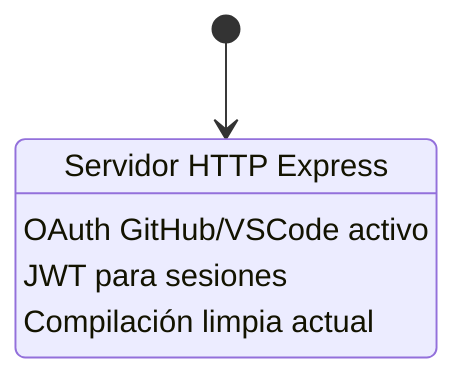

# One Spec (Root Spec)

## FASE 1 — Limpieza de Infraestructura Cloud y OAuth

## Objetivo

Eliminar **de forma segura y atómica** todos los archivos relacionados con infraestructura cloud, autenticación OAuth/JWT y servidor HTTP del proyecto MCP, dejando únicamente los componentes core (prompts, tools, templates) que serán utilizados por el servidor daemon stdio en fases posteriores.

**Meta cuantificable:** Reducir la superficie de código eliminando 9 archivos específicos (3 directorios completos + 3 archivos individuales) sin afectar la capacidad de compilación del módulo principal `src/index.ts`.

## Alcance / No alcance

### ✅ En Alcance (FASE 1)
- **Eliminación de scripts de infraestructura cloud:**
  - `src/scripts/keepalive.ts` (mantiene servidor activo en Render/cloud)
  - `test-oauth.js` (pruebas de flujo OAuth)
  - `test-vscode-flow.js` (pruebas de integración VSCode OAuth)

- **Eliminación de módulos de autenticación:**
  - `src/types/auth.types.ts` + directorio completo si queda vacío
  - `src/middleware/auth.middleware.ts` (validación JWT)
  - `src/middleware/error.middleware.ts` (manejo errores Express)
  - Directorio `src/middleware/` completo

- **Eliminación de capa OAuth completa:**
  - `src/oauth/config.ts` (configuración OAuth GitHub/VSCode)
  - `src/oauth/routes.ts` (endpoints de callback y autorización)
  - `src/oauth/storage.ts` (persistencia de tokens)
  - Directorio `src/oauth/` completo

- **Eliminación de servidor HTTP:**
  - `src/server-http.ts` (servidor Express con autenticación)

- **Verificaciones de integridad:**
  - Compilación sin errores de archivos eliminados
  - Validación de que `src/index.ts` no importa archivos eliminados
  - Confirmación de arranque del servidor post-eliminación

### ❌ Fuera de Alcance (FASE 1)
- **NO se modifica** `src/index.ts` (se hace en FASE 2)
- **NO se modifican** dependencias de `package.json` (se hace en FASE 4)
- **NO se eliminan** `src/scripts/script-java.js` ni `src/scripts/script-vscode.js` (no relacionados con OAuth)
- **NO se tocan** módulos core: `src/prompts.ts`, `src/templates/`, `src/tools/`
- **NO se ejecuta** refactorización de código legacy (hot-reload, watchers)
- **NO se actualiza** documentación (README.md se actualiza en FASE 7)

## Definiciones (lenguaje de dominio)

| Término | Definición | Contexto en FASE 1 |
|---------|-----------|-------------------|
| **Infraestructura cloud** | Código específico para despliegue en plataformas PaaS (Render, Heroku) que mantiene procesos HTTP activos | `keepalive.ts` es un keepalive que evita el sleep de dynos/workers |
| **OAuth/JWT** | Sistema de autenticación basado en OAuth 2.0 (GitHub/VSCode) + tokens JWT para sesiones | Todo el directorio `src/oauth/` y `src/middleware/auth.middleware.ts` |
| **Servidor daemon** | Proceso que corre en background usando `stdio` para comunicación IPC, sin HTTP | Meta de la migración completa; FASE 1 solo elimina componentes incompatibles |
| **Atómico** | Operación que deja el sistema en estado válido independientemente de si fases posteriores se ejecutan | Cada subfase (1.1-1.6) es independiente y verificable |
| **Dependencia entrante** | Archivo que importa/requiere otro archivo | FASE 1 verifica que ningún archivo core importa los archivos a eliminar |
| **Build limpio** | `npm run build` ejecuta TypeScript sin errores de compilación | Criterio de éxito post-eliminación |

## Principios / Reglas no negociables

### P1 — No romper el servidor principal
`src/index.ts` **DEBE** compilar y ejecutar correctamente después de cada subfase. Si una eliminación rompe el build, la fase se detiene y se reversa.

**Validación:** `npm run build && node dist/index.js` ejecuta sin errores fatales.

### P2 — Secuencialidad estricta de subfases
Las subfases 1.1 → 1.6 se ejecutan **en orden**. No se avanza a 1.2 hasta verificar 1.1.

**Razón:** Si `src/index.ts` tiene imports ocultos (e.g., re-exports), detectarlos cuanto antes.

### P3 — Verificación antes de eliminación
Antes de ejecutar `Remove-Item`, **DEBE** verificarse que el archivo/directorio existe.

**Comando de verificación PowerShell:**
```powershell
Test-Path "ruta/archivo" -PathType Leaf  # para archivos
Test-Path "ruta/directorio" -PathType Container  # para directorios
```

### P4 — No adivinar estructura de imports
Si `npm run build` falla post-eliminación con error de import, **NO** asumir que es error esperado. Investigar el stack trace completo.

**Acción correctiva:** Si el error proviene de archivos que no son los eliminados, la fase falla y requiere análisis.

### P5 — Idempotencia de comandos
Todos los comandos de eliminación **DEBEN** ser idempotentes (ejecutarlos 2 veces no debe causar error diferente).

**Implementación:** Usar `-ErrorAction SilentlyContinue` en PowerShell o verificar existencia primero.

## Límites

### Límites técnicos
- **Precondición:** El proyecto usa TypeScript con salida ESM/CommonJS híbrida (`require()` dinámico en modo desarrollo)
- **Postcondición:** El proyecto compila a JavaScript válido pero aún no es paquete npm publicable (se logra en FASE 4)
- **Sistema operativo:** Comandos optimizados para PowerShell en Windows; equivalentes bash disponibles en el plan original
- **Node.js:** Versión >= 18.0.0 (requerida por `@modelcontextprotocol/sdk`)

### Límites de alcance temporal
- **Duración estimada:** 15-30 minutos (incluye verificaciones manuales)
- **Dependencias de otras fases:** FASE 2 depende de que FASE 1 haya completado exitosamente

### Límites de riesgo aceptable
- **Riesgo bajo:** Eliminar archivos sin dependencias entrantes (todo lo de `src/oauth/`, `src/middleware/`)
- **Riesgo medio:** Eliminar `src/server-http.ts` (verificar que `src/index.ts` no lo importa)
- **Riesgo ALTO (no aplicable aquí):** Modificar archivos core — esto se hace en FASE 2

## Eventos y estados (visión raíz)

### Estado inicial (pre-FASE 1)


### Flujo de subfases (transiciones de estado)

```
Estado 0 (Inicial)
  ├─ Archivos OAuth/HTTP presentes
  ├─ Build pasa: ✅
  └─ Servidor arranca en modo HTTP
         │
         ▼
[EVENTO: Ejecutar subfase 1.1]
         │
         ▼
Estado 1.1 (Scripts cloud eliminados)
  ├─ keepalive.ts eliminado
  ├─ test-oauth.js eliminado
  ├─ test-vscode-flow.js eliminado
  ├─ Build pasa: ✅
  └─ Servidor arranca en modo HTTP
         │
         ▼
[EVENTO: Ejecutar subfase 1.2]
         │
         ▼
Estado 1.2 (Tipos auth eliminados)
  ├─ src/types/ eliminado
  ├─ Build pasa: ✅
  └─ Servidor arranca en modo HTTP
         │
         ▼
[EVENTO: Ejecutar subfase 1.3]
         │
         ▼
Estado 1.3 (Middleware eliminado)
  ├─ src/middleware/ eliminado
  ├─ Build pasa: ✅
  └─ Servidor arranca en modo HTTP
         │
         ▼
[EVENTO: Ejecutar subfase 1.4]
         │
         ▼
Estado 1.4 (OAuth eliminado)
  ├─ src/oauth/ eliminado
  ├─ Build pasa: ✅
  └─ Servidor arranca en modo HTTP
         │
         ▼
[EVENTO: Ejecutar subfase 1.5]
         │
         ▼
Estado 1.5 (HTTP server eliminado)
  ├─ src/server-http.ts eliminado
  ├─ Build pasa: ✅
  └─ Servidor arranca en modo stdio (si index.ts no lo importaba)
         │
         ▼
[EVENTO: Verificación completa 1.6]
         │
         ▼
Estado Final FASE 1
  ├─ Solo archivos core presentes
  ├─ Build pasa: ✅
  ├─ Servidor arranca: ✅
  └─ Listo para FASE 2
         │
         ▼
      [*]
```

### Invariantes de estado (válidos en TODOS los estados intermedios)
1. **`src/index.ts` existe y compila** sin errores de sintaxis TypeScript
2. **`src/prompts.ts` no se modifica** en ninguna subfase
3. **`src/templates/index.ts` no se modifica** en ninguna subfase
4. **`src/tools/index.ts` no se modifica** en ninguna subfase
5. **`package.json` no se modifica** en FASE 1 (se actualiza en FASE 4)

## Criterios de aceptación (root)

### CA-1: Eliminación completa de archivos objetivo
**Dado** que FASE 1 ha sido ejecutada  
**Cuando** se ejecuta:
```powershell
Get-ChildItem -Recurse | Where-Object { $_.Name -match "oauth|keepalive|test-oauth|test-vscode-flow|auth\.middleware|error\.middleware|server-http|auth\.types" }
```
**Entonces** el comando retorna **0 resultados**.

**Criterio de éxito:** Ningún archivo con nombres relacionados a OAuth/auth/http existe en el proyecto.

---

### CA-2: Directorio src/types eliminado si estaba vacío
**Dado** que `src/types/` solo contenía `auth.types.ts`  
**Cuando** se elimina `auth.types.ts`  
**Entonces** el directorio `src/types/` debe eliminarse también.

**Validación:**
```powershell
Test-Path "src\types" -PathType Container
# Resultado esperado: False
```

**Excepción:** Si `src/types/` contenía otros archivos (no mencionados en el workspace), el directorio permanece.

---

### CA-3: Compilación TypeScript sin errores
**Dado** que todos los archivos han sido eliminados  
**Cuando** se ejecuta `npm run build`  
**Entonces** la salida muestra **0 errores de compilación**.

**Comando de validación:**
```powershell
npm run build 2>&1 | Select-String "error TS"
# Resultado esperado: ninguna línea coincidente
$LASTEXITCODE -eq 0  # Código de salida 0
```

**Criterio de éxito:** El archivo `dist/index.js` se genera correctamente.

---

### CA-4: Arranque del servidor sin errores fatales
**Dado** que el build pasó  
**Cuando** se ejecuta `node dist/index.js`  
**Entonces** el proceso:
- Arranca sin lanzar excepciones no capturadas
- Escucha en stdin (modo stdio)
- Puede terminarse con `Ctrl+C` sin errores

**Validación:**
```powershell
$job = Start-Job { node dist/index.js }
Start-Sleep 3
$state = $job.State  # Debe ser "Running"
Stop-Job $job
Remove-Job $job
```

**Criterio de éxito:** `$state -eq "Running"` → el servidor no crasheó en los primeros 3 segundos.

---

### CA-5: Archivos core intactos
**Dado** que FASE 1 ha sido ejecutada  
**Cuando** se comparan checksums SHA256 de archivos core  
**Entonces** los siguientes archivos **NO han cambiado**:
- `src/prompts.ts`
- `src/templates/index.ts`
- `src/tools/index.ts`
- `src/tools/types.ts`

**Validación:**
```powershell
# Antes de FASE 1:
$hash_prompts_antes = (Get-FileHash "src\prompts.ts").Hash

# Después de FASE 1:
$hash_prompts_despues = (Get-FileHash "src\prompts.ts").Hash

$hash_prompts_antes -eq $hash_prompts_despues  # Debe ser True
```

---

### CA-6: Estructura de directorios esperada
**Dado** que FASE 1 ha sido ejecutada  
**Cuando** se lista `src/`  
**Entonces** la estructura es:

```
src/
├── index.ts ✅
├── prompts.ts ✅
├── server-http.ts ❌ (eliminado)
├── middleware/ ❌ (eliminado)
├── oauth/ ❌ (eliminado)
├── types/ ❌ (eliminado)
├── public/
├── scripts/
│   ├── script-java.js ✅
│   ├── script-vscode.js ✅
│   └── keepalive.ts ❌ (eliminado)
├── services/
├── templates/
│   └── [archivos .template.ts] ✅
└── tools/
    ├── index.ts ✅
    └── types.ts ✅
```

**Validación:**
```powershell
Test-Path "src\middleware" -PathType Container  # False
Test-Path "src\oauth" -PathType Container       # False
Test-Path "src\types" -PathType Container       # False
Test-Path "src\server-http.ts" -PathType Leaf   # False
Test-Path "src\index.ts" -PathType Leaf         # True
Test-Path "src\prompts.ts" -PathType Leaf       # True
```

---

### CA-7: Logs de eliminación sin errores (PowerShell)
**Dado** que se ejecutan comandos `Remove-Item`  
**Cuando** se registra la salida de cada comando  
**Entonces** ningún comando produce:
- `Access denied`
- `File not found` (si se validó existencia primero)
- `Directory not empty` (al eliminar directorio recursivamente)

**Implementación robusta:**
```powershell
if (Test-Path "src\oauth" -PathType Container) {
    Remove-Item "src\oauth" -Recurse -Force -ErrorAction Stop
    Write-Host "✅ src/oauth eliminado"
} else {
    Write-Warning "⚠️ src/oauth ya no existe (idempotencia OK)"
}
```

## Trazabilidad

### Mapeo a Plan de Trabajo Original
Esta especificación ONE_SPEC corresponde a:
- **Documento origen:** `PLAN_TRABAJO_DAEMON.md`
- **Sección:** FASE 1 — Limpiar archivos de infraestructura cloud y OAuth
- **Líneas:** 10-89 del documento original

### Subfases y comandos de ejecución

| Subfase | Archivos objetivo | Comando PowerShell | Verificación |
|---------|------------------|-------------------|--------------|
| **1.1** | Scripts cloud | `Remove-Item "src\scripts\keepalive.ts"; Remove-Item "test-oauth.js", "test-vscode-flow.js"` | `Get-ChildItem src/scripts/` muestra solo `.js` |
| **1.2** | Tipos auth | `Remove-Item "src\types\auth.types.ts"; if ((Get-ChildItem "src\types").Count -eq 0) { Remove-Item "src\types" -Recurse }` | `Test-Path "src\types"` → False |
| **1.3** | Middleware | `Remove-Item "src\middleware\auth.middleware.ts", "src\middleware\error.middleware.ts"; Remove-Item "src\middleware" -Recurse` | `Test-Path "src\middleware"` → False |
| **1.4** | OAuth | `Remove-Item "src\oauth" -Recurse` | `Test-Path "src\oauth"` → False |
| **1.5** | HTTP server | `Remove-Item "src\server-http.ts"` | `Test-Path "src\server-http.ts"` → False |
| **1.6** | Compilación final | `npm run build; node dist/index.js` | Build sin errores, servidor arranca |

### Dependencias con otras fases

```
  [FASE 1] ← ESTE DOCUMENTO
       │
       ├─ Éxito → FASE 2 puede iniciar
       │          (Reescritura de src/index.ts)
       │
       └─ Fallo → Rollback con git reset
                  Analizar por qué src/index.ts tenía imports ocultos
```

### Relación con objetivos del proyecto completo
**Objetivo global:** Migración a servidor daemon distribuible vía npm  
**Contribución de FASE 1:** Elimina 100% de la infraestructura HTTP/OAuth que no es compatible con modelo stdio  
**Porcentaje de progreso:** FASE 1 representa ~20% del trabajo total (1 de 6 fases técnicas)

### Salidas documentales
Al completar FASE 1, el proyecto debe poder demostrar:
1. **Evidencia de eliminación:** Capturas de `Get-ChildItem` mostrando directorios inexistentes
2. **Build log limpio:** Salida de `npm run build` sin errores
3. **Commit de cierre:** Mensaje descriptivo con checklist de subfases

**Ejemplo de commit message:**
```
chore(fase1): remove cloud infra, oauth, jwt, http server

- ✅ 1.1: Removed keepalive.ts and test scripts
- ✅ 1.2: Removed src/types/auth.types.ts
- ✅ 1.3: Removed src/middleware/* (auth & error)
- ✅ 1.4: Removed src/oauth/* (config, routes, storage)
- ✅ 1.5: Removed src/server-http.ts
- ✅ 1.6: Build passes, server starts correctly

BREAKING CHANGE: HTTP/OAuth endpoints no longer available.
Project now in intermediate state for stdio daemon migration.
```

---

## Apéndice A: Script de ejecución automática FASE 1

```powershell
# fase1-cleanup.ps1
# Ejecución atómica de FASE 1 con rollback automático en caso de error

$ErrorActionPreference = "Stop"

function Test-FileExists {
    param([string]$Path, [string]$Type)
    $exists = Test-Path $Path -PathType $Type
    if ($exists) {
        Write-Host "✓ Encontrado: $Path" -ForegroundColor Green
    } else {
        Write-Warning "⚠ No existe: $Path (puede ser esperado)"
    }
    return $exists
}

function Remove-SafeItem {
    param([string]$Path, [string]$Description)
    if (Test-Path $Path) {
        Remove-Item $Path -Recurse -Force
        Write-Host "✅ Eliminado: $Description" -ForegroundColor Cyan
    } else {
        Write-Host "⏭ Ya eliminado: $Description" -ForegroundColor Gray
    }
}

try {
    Write-Host "`n🚀 Iniciando FASE 1: Limpieza OAuth/HTTP`n" -ForegroundColor Yellow

    # Subfase 1.1
    Write-Host "[1.1] Eliminando scripts de infraestructura cloud..." -ForegroundColor Magenta
    Remove-SafeItem "src\scripts\keepalive.ts" "keepalive.ts"
    Remove-SafeItem "test-oauth.js" "test-oauth.js"
    Remove-SafeItem "test-vscode-flow.js" "test-vscode-flow.js"

    # Subfase 1.2
    Write-Host "`n[1.2] Eliminando tipos de autenticación..." -ForegroundColor Magenta
    Remove-SafeItem "src\types\auth.types.ts" "auth.types.ts"
    if (Test-Path "src\types" -PathType Container) {
        $filesInTypes = Get-ChildItem "src\types" -File
        if ($filesInTypes.Count -eq 0) {
            Remove-Item "src\types" -Recurse -Force
            Write-Host "✅ Directorio src/types eliminado (estaba vacío)" -ForegroundColor Cyan
        } else {
            Write-Host "⚠ src/types contiene otros archivos, no se elimina" -ForegroundColor Yellow
        }
    }

    # Subfase 1.3
    Write-Host "`n[1.3] Eliminando middleware..." -ForegroundColor Magenta
    Remove-SafeItem "src\middleware" "src/middleware (completo)"

    # Subfase 1.4
    Write-Host "`n[1.4] Eliminando capa OAuth..." -ForegroundColor Magenta
    Remove-SafeItem "src\oauth" "src/oauth (completo)"

    # Subfase 1.5
    Write-Host "`n[1.5] Eliminando servidor HTTP..." -ForegroundColor Magenta
    Remove-SafeItem "src\server-http.ts" "server-http.ts"

    # Subfase 1.6
    Write-Host "`n[1.6] Verificando compilación..." -ForegroundColor Magenta
    npm run build | Out-Null
    if ($LASTEXITCODE -ne 0) {
        throw "❌ npm run build falló con código $LASTEXITCODE"
    }
    Write-Host "✅ Build exitoso" -ForegroundColor Green

    Write-Host "`n🎉 FASE 1 COMPLETADA CON ÉXITO`n" -ForegroundColor Green
    Write-Host "Próximo paso: Ejecutar FASE 2 (reescritura de src/index.ts)" -ForegroundColor Yellow

} catch {
    Write-Host "`n❌ ERROR EN FASE 1: $_`n" -ForegroundColor Red
    Write-Host "Ejecutar rollback:" -ForegroundColor Yellow
    Write-Host "  git reset --hard HEAD" -ForegroundColor Cyan
    exit 1
}
```

**Uso:**
```powershell
# Desde el directorio raíz del proyecto:
.\fase1-cleanup.ps1
```

---

## Apéndice B: Checklist de verificación manual

Use esta lista para validar manualmente que FASE 1 se completó correctamente:

- [ ] **Pre-requisito:** Commit snapshot creado (`git log` muestra commit reciente)
- [ ] **Pre-requisito:** Branch `feat/daemon-mode-fase1` creado y activo

**Subfase 1.1:**
- [ ] `src/scripts/keepalive.ts` no existe
- [ ] `test-oauth.js` no existe
- [ ] `test-vscode-flow.js` no existe
- [ ] `Get-ChildItem src/scripts/` muestra solo `script-java.js` y `script-vscode.js`

**Subfase 1.2:**
- [ ] `src/types/auth.types.ts` no existe
- [ ] `src/types/` no existe (si estaba vacío)

**Subfase 1.3:**
- [ ] `src/middleware/auth.middleware.ts` no existe
- [ ] `src/middleware/error.middleware.ts` no existe
- [ ] `src/middleware/` no existe

**Subfase 1.4:**
- [ ] `src/oauth/config.ts` no existe
- [ ] `src/oauth/routes.ts` no existe
- [ ] `src/oauth/storage.ts` no existe
- [ ] `src/oauth/` no existe

**Subfase 1.5:**
- [ ] `src/server-http.ts` no existe

**Subfase 1.6:**
- [ ] `npm run build` ejecuta sin errores (código de salida 0)
- [ ] `dist/index.js` existe y tiene contenido válido
- [ ] `node dist/index.js` arranca sin crash inmediato (3+ segundos)

**Post-FASE 1:**
- [ ] Archivos core intactos: `src/prompts.ts`, `src/templates/index.ts`, `src/tools/index.ts`
- [ ] Commit de cierre creado con mensaje descriptivo
- [ ] Listo para iniciar FASE 2